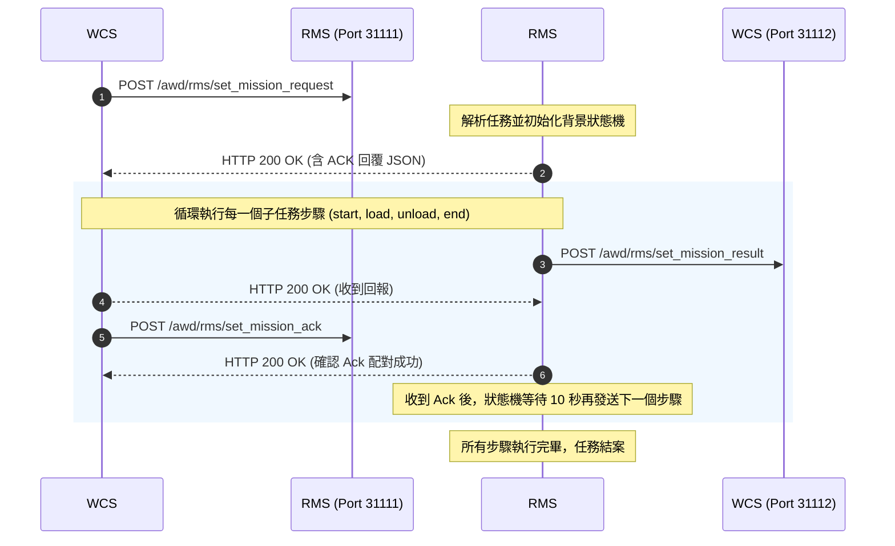

# WCS - RMS 搬運控制模擬系統

本專案實作了一套 AMR 搬運任務控制流程模擬器，用以模擬 RMS (Robot Management System) 與 WCS (Warehouse Control System) 之間的 API 互動。

系統遵循**「Request（請求） - Result（執行結果） - Ack（步驟確認）」**三階段互動原則，並內建步驟之間的延遲等待機制。

---

## 運作邏輯

任務流程以 AMR 從 `A-01-2` 搬運貨物至 `L-01-0` 為例，共分為 4 個主要子任務 (sub-missions)：`start` ➜ `load` ➜ `unload` ➜ `end`。

### 互動流程圖



### 狀態機細節

1. **任務觸發**：WCS 發送任務請求後，RMS 立即回覆包含 `ACK` 的 JSON，並啟動背景執行緒狀態機。
2. **結果回報 (`set_mission_result`)**：
   - RMS 主動呼叫 WCS 的結果接收端點。
   - 子任務為 `load` 時，`reason` 欄位會攜帶棧板 ID `"01"`。其餘步驟 `reason` 皆為 `"NA"`。
3. **確認接收 (`set_mission_ack`)**：
   - WCS 收到結果後，非同步發送確認 (Ack) 給 RMS 的確認端點。
   - RMS 比對 `sequence` 與 `action`，成功配對則觸發信號。
4. **10秒延遲機制**：RMS 收到 Ack 信號後，**等待 10 秒**，隨後才發送下一個子任務的結果。

---

## API 端點說明

### 1. RMS 伺服器 (預設 Port: `31111`)

- **`POST /awd/rms/set_mission_request`**：接收 WCS 任務指派。
- **`POST /awd/rms/set_mission_ack`**：接收 WCS 對目前子任務步驟的確認訊號。

### 2. WCS 伺服器 (預設 Port: `31112`)

- **`POST /awd/rms/set_mission_result`**：接收 RMS 回報之子任務執行結果。

---

## 啟動與使用方式

本專案完全基於 **Python 內建標準庫** 實作，無需安裝額外套件（免 `pip install`）。

### 步驟 1: 啟動 RMS 模擬器

開啟一個終端機，執行：

```powershell
python rms_simulator.py
```

*(可用參數：`--port` 指定監聽 Port，`--wcs-port` 指定要連線的 WCS Port)*

### 步驟 2: 啟動 WCS 模擬器

開啟第二個終端機，執行：

```powershell
python wcs_simulator.py
```

*(可用參數：`--port` 指定監聽 Port，`--rms-port` 指定要連線的 RMS Port)*

### 步驟 3: 觸發測試任務

在 WCS 模擬器的控制台畫面中，將顯示命令列提示符 `WCS> `：

- 輸入 **`send`** 並按 Enter：開始發送預設的測試任務 `M1000001`。
- 輸入 **`send <自訂任務序號>`** (例如 `send M2026`)：發送自訂序號的測試任務。
- 輸入 **`exit`**：退出程式。

---

## 日誌紀錄說明

每次 API 呼叫的接收與發送皆會詳實紀錄於日誌中，包含：**接收時間（當地時區）、請求 URL、Method、以及 JSON Body 內容**。

* **RMS 日誌**：儲存於 `rms_simulator.log` 並輸出至 Console。
* **WCS 日誌**：儲存於 `wcs_simulator.log` 並輸出至 Console。
