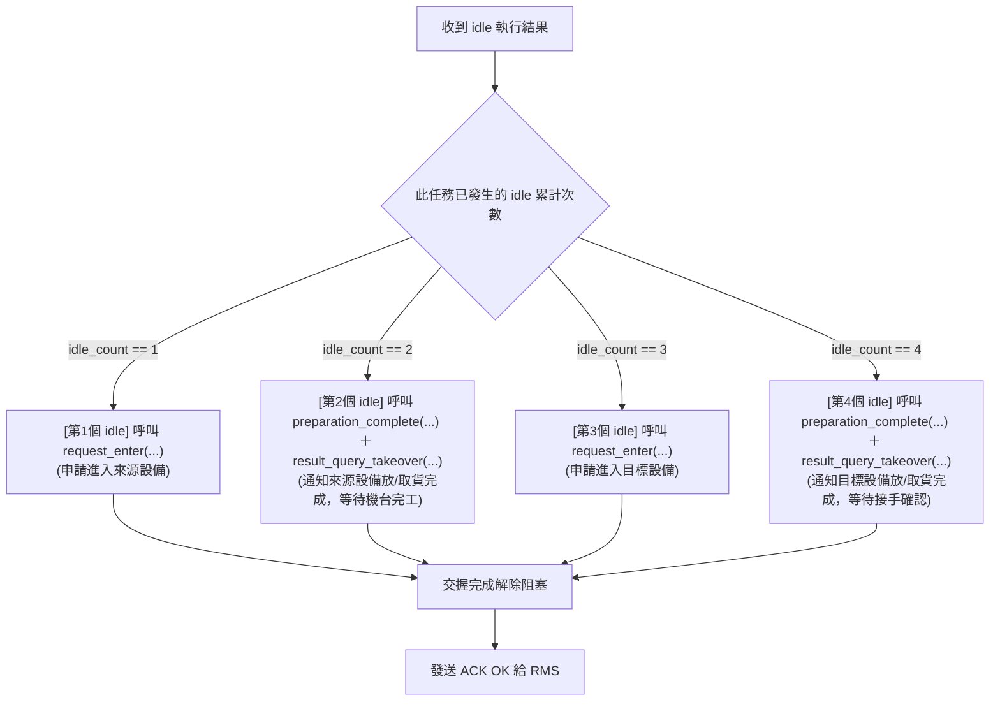

# WCS - RMS 設備交握整合規範 (v1.1)

本文件定義 WCS 與 RMS 之間在執行搬運任務時，針對需要設備交握（Handshaking）的節點所採用的 Python Function Call 介面規範。

本規範整合了 `[equip_handshaking_function_v1.2.md](file:///c:/Sean_Documents/RMS+WCS_sim+Handshaking/equip_handshaking/equip_handshaking_function_v1.2.md)` 的 EAP 介面，並以**特定步驟編號分支**的形式，指導 WCS 如何針對不同步驟順序的機台交接點進行客製化擴充。

---

## 1. 基礎概念與查找表

在搬運任務中，每個設備交互點均採用**「一進一出、分步交握」**的設計：
* **`sourcepoint / targetpoint`**：AMR 執行 `load` 或 `unload` 的實體機台工位。
* **`waiting point` (以 `_W` 結尾)**：進入實體工位前的訊號交握與等待點，由工位 ID 透過 `HS_lookup_table` 查詢而得。
* **`idle` 動作**：在 waiting point 上，系統將會利用 `idle` 動作來觸發設備交握。

### 設備交握查找表 (`HS_lookup_table`) 範例：
| point_id | wait_point | machine_type | need_hs |
| :--- | :--- | :--- | :--- |
| R01_P01 | R01WP01 | Station | yes |
| WRP_501 | WRPW501 | Wrap | yes |
| PalletSupply#1 | PalletSupply#1_W | PalletSupply | yes |
| Robot_n | Robot_n_W | Station | yes |

---

## 2. WCS 任務格式 (Sub-missions) 範例

當任務中包含多個設備的連續對接時，`sub_missions` 中將會出現多個 `idle` 動作。例如以下 `HS_HS.json` 的對接任務配置：

```json
{
  "sequence": "HS_HS_M001",
  "timestamp": "2026-07-10 09:00:01.0000",
  "priority": "128",
  "sub_missions": [
    { "space": "PalletSupply#1_W", "action": "start" },   // 直接回覆 ACK
    { "space": "PalletSupply#1_W", "action": "idle" },    // [第 1 個 idle] 進入設備#1 申請
    { "space": "PalletSupply#1",   "action": "load" },    // 直接回覆 ACK
    { "space": "PalletSupply#1_W", "action": "idle" },    // [第 2 個 idle] 出設備#1 通知與完工等待
    { "space": "Robot_n_W",        "action": "idle" },    // [第 3 個 idle] 進入設備#2 申請
    { "space": "Robot_n",          "action": "unload" },  // 直接回覆 ACK
    { "space": "Robot_n_W",        "action": "idle" },    // [第 4 個 idle] 出設備#2 通知與完工等待
    { "space": "Robot_n",          "action": "end" }      // 直接回覆 ACK
  ]
}
```

---

## 3. WCS ACK 回覆與 EAP 交握觸發邏輯

當 WCS 收到 RMS 針對各 Action 回報之 `set_mission_result`（狀態為 `OK`）時，WCS 端回覆 ACK 給 RMS 的邏輯規範如下：

### A. 非 `idle` 動作
當 Action 為 `start`、`load`、`unload`、`end` 時，WCS **直接回覆 ACK OK** 給 RMS，無須進行 EAP 設備交握。

### B. `idle` 動作 (進行 EAP 設備交握)
當 Action 為 `idle` 時，代表 AMR 處於 waiting point。WCS 透過計數器追蹤當前 sequence 累積遇到的 `idle` 序號（`idle_count`），並利用 **`if-elif` 條件式分支** 進行精確的分流處理：



#### 1. `idle_count == 1`：進入第一個設備申請
* **時機**：車輛抵達第一等待點，準備進入第一個工位作業。
* **交握動作**：呼叫 `[request_enter](file:///c:/Sean_Documents/RMS+WCS_sim+Handshaking/equip_handshaking/equip_handshaking_function_v1.2.md#L35)` 函式。
* **呼叫參數**：
  * `equipment_type`：自 `HS_lookup_table` 查出。
  * `wes_id`：工位識別代號（如 `PalletSupply#1`）。
  * `purpose_mode`：對應之目的模式。
* **後續**：機台確認返回 `"OK"` 後，WCS 發送 ACK 回應給 RMS，允許車輛執行 `load`。

#### 2. `idle_count == 2`：退出第一個設備通知與完工等待
* **時機**：車輛於第一個工位完成作業，完全退出至等待點後。
* **交握動作**：
  1. 呼叫 `[preparation_complete](file:///c:/Sean_Documents/RMS+WCS_sim+Handshaking/equip_handshaking/equip_handshaking_function_v1.2.md#L125)`，通知機台已放置/取走貨物。
  2. 接著呼叫 `[result_query_takeover](file:///c:/Sean_Documents/RMS+WCS_sim+Handshaking/equip_handshaking/equip_handshaking_function_v1.2.md#L161)`，同步阻塞等待機台自動化作業完成並回傳結果。
* **後續**：成功後釋放資源，WCS 發送 ACK 給 RMS。

#### 3. `idle_count == 3`：進入第二個設備申請
* **時機**：車輛抵達第二等待點，準備進入第二工位作業。
* **交握動作**：呼叫 `[request_enter](file:///c:/Sean_Documents/RMS+WCS_sim+Handshaking/equip_handshaking/equip_handshaking_function_v1.2.md#L35)` 函式（目的模式為進入放貨，例如 `Station` 目的模式 1）。
* **後續**：機台返回 `"OK"` 後，WCS 發送 ACK 回應給 RMS，允許車輛執行 `unload`。

#### 4. `idle_count == 4`：退出第二個設備通知與完工等待
* **時機**：車輛於第二個工位完成作業，完全退出至等待點後。
* **交握動作**：
  1. 呼叫 `[preparation_complete](file:///c:/Sean_Documents/RMS+WCS_sim+Handshaking/equip_handshaking/equip_handshaking_function_v1.2.md#L125)`，通知機台完成放置/取走。
  2. 接著呼叫 `[result_query_takeover](file:///c:/Sean_Documents/RMS+WCS_sim+Handshaking/equip_handshaking/equip_handshaking_function_v1.2.md#L161)`，等待設備接手確認並完成運作。
* **後續**：成功後釋放資源，WCS 發送 ACK 給 RMS。

---

## 4. WCS 模擬器程式碼整合與擴充指南

在 `[wcs_simulator.py](file:///c:/Sean_Documents/RMS+WCS_sim+Handshaking/wcs_simulator.py)` 中，主事件迴圈處理設備交握與 ACK 發送的部分，採用 **特定步驟編號分支 (`if-elif` 結構)** 進行實作：

```python
            if pending_acks:
                res = pending_acks.pop(0)
                action = res['action']
                space = res['space']
                
                if action == "idle":
                    # 取得該 sequence 累積遇到的 idle 次數
                    idle_count = get_idle_counter(res['sequence'])
                    
                    # 查詢 HS_lookup_table 取得設備參數
                    equip_type, wes_id, purpose_mode = lookup_hs_info(space)
                    
                    if idle_count == 1:
                        # [進入來源設備]
                        print(f"\n[設備交握 #1] 申請進入 {equip_type} (ID: {wes_id})...")
                        request_enter(equip_type, wes_id, purpose_mode)
                        
                    elif idle_count == 2:
                        # [出來源設備並等待完工]
                        print(f"\n[設備交握 #2] 準備完成通知，等待 {equip_type} (ID: {wes_id}) 完工...")
                        preparation_complete(equip_type, wes_id, purpose_mode)
                        result_query_takeover(equip_type, wes_id, purpose_mode)
                        
                    elif idle_count == 3:
                        # [進入目標設備]
                        print(f"\n[設備交握 #3] 申請進入 {equip_type} (ID: {wes_id})...")
                        request_enter(equip_type, wes_id, purpose_mode)
                        
                    elif idle_count == 4:
                        # [出目標設備並等待完工]
                        print(f"\n[設備交握 #4] 準備完成通知，等待 {equip_type} (ID: {wes_id}) 完工...")
                        preparation_complete(equip_type, wes_id, purpose_mode)
                        result_query_takeover(equip_type, wes_id, purpose_mode)
                        
                    # =========================================================================
                    # [未來擴充位置：若任務中 idle 數量增加至 6, 8, 10 等多個時]
                    # 請在此處針對第 5, 6, 7, 8 次遇到的 idle 繼續添加條件分支：
                    # =========================================================================
                    elif idle_count == 5:
                        # [進入第三個設備，例如：中間加工機台]
                        print(f"\n[設備交握 #5] 申請進入 {equip_type}...")
                        request_enter(equip_type, wes_id, purpose_mode)
                        
                    elif idle_count == 6:
                        # [出第三個設備並等待完工]
                        print(f"\n[設備交握 #6] 準備完成通知，等待 {equip_type} 完工...")
                        preparation_complete(equip_type, wes_id, purpose_mode)
                        res_data = result_query_takeover(equip_type, wes_id, purpose_mode)
                        # 客製化業務：例如第 6 步完成後發送通知
                        notify_erp_finished(res_data.get("palletNo"))
                else:
                    # 非 idle 動作，直接通過
                    pass
                
                # 完成上述 EAP 交握後，自動發送 ACK 回應給 RMS 推進任務
                send_ack_to_rms(res['sequence'], res['action'], res['priority'], res['protocol_version'])
```
* **如何修改與擴充程式**：
  1. 當任務包含更多組設備交接時（例如 3 組設備，共 6 個 `idle`），工程師需於主迴圈的條件式中，依據 `idle_count` 數值**追加新的分支**（如上例中的 `elif idle_count == 5:` 與 `elif idle_count == 6:`）。
  2. 奇數編號為進入申請（呼叫 `request_enter`），偶數編號為完工確認與釋放（依序呼叫 `preparation_complete` 與 `result_query_takeover`），亦可於特定分支中直接撰寫專屬的業務處理邏輯。
