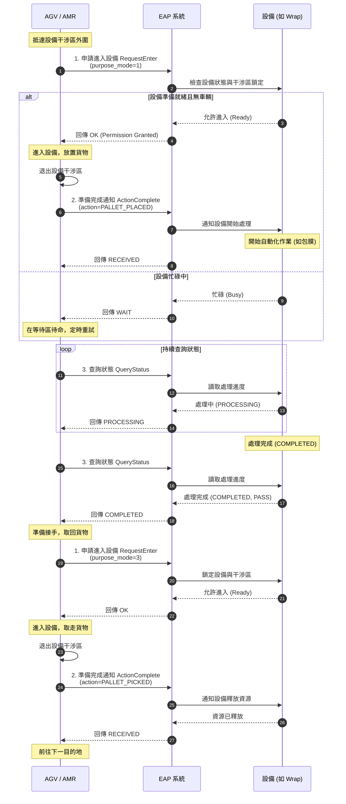

# 永聯聯華觀音廠 - EAP 設備交握規範

本文件定義 AGV/AMR、EAP (Equipment Automation Protocol) 與各生產設備 (Equipment) 之間的訊號交握流程與 API 介面規範，以確保物流搬運過程的流暢性與資源排他性。

## 1. 支援設備類型 (Equipment Types)
| 設備代碼 | 設備名稱 | 說明 |
| :--- | :--- | :--- |
| `Wrap` | 包膜機 | 負責貨品的外層防護薄膜包覆 |
| `Check` | 檢查站/檢驗設備 | 進行貨品外觀、條碼或重量檢驗 |
| `Aligner` | 對齊/糾偏機 | 修正貨品/棧板在搬運載具上的中心點與角度 |
| `PalletSupply` | 棧板供應機 | 提供空棧板或收集空棧板的設備 |
| `Robot` | 機械手臂 | 進行貨品拆疊棧或抓取搬運的自動化手臂 |

---

## 2. 功能模組與 API 規格

### ［1］ 申請進入設備 (Request Enter)
- **目的**：AGV/AMR 進入機台工作範圍（例如物理干涉區、交接工位）前，必須向 EAP 申請進入，設定搬運模式並取得機台確認/核可，以防止碰撞並鎖定設備資源。
- **介面定義**：
  - **方法**：`POST`
  - **路徑**：`/api/v1/equipment/request-enter`
- **Request Body (JSON)**：
  ```json
  {
    "equipment_type": "Wrap",
    "equipment_id": "WRAP_01",
    "wes_id": "WES_TASK_20260703_001",
    "purpose_mode": 1
  }
  ```
  - **欄位說明**：
    - `equipment_type` (String): 設備類型，如 `Wrap`, `Check`, `Aligner`, `PalletSupply`, `Robot`。
    - `equipment_id` (String): 具體設備編號。
    - `wes_id` (String): WES 任務 ID，用於追蹤搬運任務。
    - `purpose_mode` (Integer): 申請進入的目的模式。
      - `1`: 預包膜 (Pre-wrapping)
      - `2`: 全包膜 (Full-wrapping)
      - `3`: 單板進 (Single pallet in) / 單板出 (Single pallet out)
      - `4`: 整板進 (Full stack in) / 整板出 (Full stack out)
- **Response Body (JSON)**：
  ```json
  {
    "status": "OK", 
    "message": "Permission granted. Equipment is ready."
  }
  ```
  *(註：若機台正忙碌或有其他車輛佔用，則回傳 `"status": "WAIT"`，車輛須在等待區待命)*

---

### ［2］ 準備完成通知 (Action Complete)
- **目的**：AGV/AMR 進入機台完成貨物放置/取走動作，且車體已完全退出機台干涉區後，通知 EAP 動作已完成，以便機台接手後續的自動化動作。
- **介面定義**：
  - **方法**：`POST`
  - **路徑**：`/api/v1/equipment/action-complete`
- **Request Body (JSON)**：
  ```json
  {
    "equipment_id": "WRAP_01",
    "wes_id": "WES_TASK_20260703_001",
    "action": "PALLET_PLACED",
    "timestamp": "2026-07-03T11:05:00Z"
  }
  ```
  - **欄位說明**：
    - `action` (String): 執行的動作類型。例如 `PALLET_PLACED` (貨物已放置)、`PALLET_PICKED` (貨物已取走)。
- **Response Body (JSON)**：
  ```json
  {
    "status": "RECEIVED",
    "message": "Action complete acknowledged. Handing over to equipment."
  }
  ```

---

### ［3］ 等待處理結果並再次進入設備接手 (Query Status & Re-enter)
- **目的**：交接給機台後，EAP 持續查詢機台的處理狀態（例如包膜完成、檢驗合格）。當機台完成對應動作後，AGV/AMR 將再次申請進入設備，取走貨物並釋放設備資源。
- **介面定義**：
  - **方法**：`GET`
  - **路徑**：`/api/v1/equipment/status`
  - **參數**：`?equipment_id=WRAP_01&wes_id=WES_TASK_20260703_001`
- **Response Body (JSON)**：
  ```json
  {
    "equipment_id": "WRAP_01",
    "wes_id": "WES_TASK_20260703_001",
    "process_status": "COMPLETED",
    "result_code": "PASS",
    "message": "Equipment processing complete."
  }
  ```
  - **欄位說明**：
    - `process_status` (String): `PROCESSING` (處理中) / `COMPLETED` (已完成) / `ERROR` (設備異常)。
    - `result_code` (String): 處理結果，如 `PASS` (合格)、`FAIL` (不合格/異常)。
- **後續步驟**：
  1. 當 `process_status` 為 `COMPLETED` 時，AGV/AMR 再次發起 `RequestEnter`（目的模式設為取貨）。
  2. 進入設備並完成取貨。
  3. 再次呼叫 `ActionComplete`（`action` 設為 `PALLET_PICKED`），釋放機台鎖定資源。

---

### ［4］ 心跳機制 (Heartbeat)
- **目的**：EAP 與各設備/AGV 之間維持 Keep-alive 連線狀態檢查，確保通訊未中斷。若在特定時間內未收到心跳包，系統應觸發斷線警報並暫停相關自動化作業。
- **介面定義**：
  - **方法**：`POST`
  - **路徑**：`/api/v1/equipment/heartbeat`
- **Request Body (JSON)**：
  ```json
  {
    "node_id": "AGV_01",
    "timestamp": "2026-07-03T11:05:30Z"
  }
  ```
- **Response Body (JSON)**：
  ```json
  {
    "status": "ALIVE",
    "timestamp": "2026-07-03T11:05:31Z"
  }
  ```

---

## 3. 交握時序圖 (Interaction Flow)

以下展示完整的 AGV/AMR 運送貨物至機台（如包膜機）、等待處理、並取走之完整交握時序：


