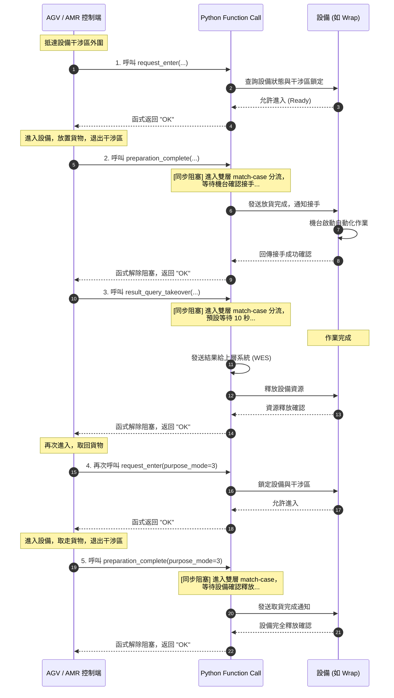

# EAP 設備交握規範 (Python Function Call 介面)

本文件定義 AGV/AMR、EAP (Equipment Automation Protocol) 與各生產設備 (Equipment) 之間的訊號交握流程與 Python Function Call 介面規範，以確保物流搬運過程的流暢性與資源排他性。

交握邏輯採用 **同步式等待 (Sync Blocking Wait)** 設計，呼叫端 (AGV/AMR 控制程式) 呼叫函式後會阻塞等待，直到取得機台回傳的對應確認訊號或處理結果。

---

## 1. 支援設備類型、目的與模式 (Equipment Types, Purpose Modes)

| machine_type | 設備名稱        | purpose mode | purpose mode 說明 | other args for request_enter | return result from result_query_takeover  |
| ------------ | --------------- | ------------ | ----------------- | ---------------------------- | ----------------------------------------- |
| Wrap         | 包膜機          | 1            | Pre_Wrap 進入     | -                            | isOK/Wait                                 |
| Wrap         | 包膜機          | 2            | Full_Wrap 進入    | -                            | isOK/Wait                                 |
| Wrap         | 包膜機          | 3            | 完工取貨          | -                            | isOK/Wait                                 |
| Check        | 檢查站/檢驗設備 | 1            | 檢測進出          | -                            | isOK/Wait, result, okNG, highLow,palletNo |
| Aligner      | 對齊/糾偏機     | 1            | 檢測進、出        | -                            | isOK/Wait, result, okNG, highLow,palletNo |
| PalletSupply | 棧板供收機      | 1            | 取單板            | -                            | isOK/Wait, 最底層 palletNo                |
| PalletSupply | 棧板供收機      | 2            | 收單板            | -                            | isOK/Wait, 最底層 palletNo                |
| PalletSupply | 棧板供收機      | 3            | 供滿版            | -                            | isOK/Wait, 最底層 palletNo                |
| PalletSupply | 棧板供收機      | 4            | 收滿版            | -                            | isOK/Wait, 最底層 palletNo                |
| ASRS_IPORT   | ASRS 入口區     | 1            | 進入放貨(滿架)    | PalletNo,貨物高度, 空架到位  | isOK/Wait,                                |
| ASRS_IPORT   | ASRS 入口區     | 2            | 進入載空架離開    | -                            | isOK/Wait,                                |
| ASRS_OPORT   | ASRS 出口區     | 1            | 進入取貨(滿架)    | -                            | isOK/Wait,PalletNo                        |
| ASRS_OPORT   | ASRS 出口區     | 2            | 進入放空架        | 空架到位                     | isOK/Wait                                 |
| LIFT         | 提升機          | 1            | 放貨              | PalletNo,貨物高度            | isOK/Wait                                 |
| LIFT         | 提升機          | 2            | 取貨              | -                            | isOK/Wait,PalletNo                        |

補充調整:

1. 參考上表，實作所有機台與目的模式的交握流程與 Python function.
2. request_enter:
   - 根據不同機台類型、目的模式，模擬不同的等候時間，並回傳 OK 或 WAIT.
   - 根據不同機台類型、目的模式，設定不同 arguments
   - 輸出 Log 要包含機台類型、目的模式
3. preparation_complete:
   - 根據不同機台類型、目的模式，模擬不同的等候時間，並回傳 OK 或 WAIT.
   - 輸出 Log 要包含機台類型、目的模式
4. result_query_takeover:
   - 根據不同機台類型、目的模式，模擬不同的等候時間，並回傳 OK 或 WAIT.
   - 根據不同機台類型、目的模式，回傳不同 result ，result 基本包含 isOK/Wait, result, okNG, highLow,palletNo 等資訊
   - 輸出 Log 要包含機台類型、目的模式

---

## 2. 功能模組與 Python Function 介面

### ［1］ 申請進入設備 (Request Enter)

- **目的**：AGV/AMR 進入機台工作範圍（例如物理干涉區、交接工位）前，必須向 Python Function 申請進入，以防止碰撞並鎖定設備資源。
- **Python 函式簽章與實作**：

  ```python
  def request_enter(
       equipment_type: str,
       wes_id: str,
      purpose_mode: int
  ) -> str:
      """
      申請進入設備。

      :param equipment_type: 設備類型 (Wrap, Check, Aligner, PalletSupply)
      :param wes_id: WES_ID
      :param purpose_mode: 申請目的模式 (1=預包膜, 2=全包膜, 3=單板進出, 4=整板進出)
      :return: "OK" (允許進入) 或 "WAIT" (設備忙碌，須在等待區待命)
      """
  ```

- **核心分流邏輯 (基於雙層 match-case)**：
  ```python
  match equipment_type:
      case "Wrap":
          match purpose_mode:
              case 1:
                  print("  -> [Match-Case] 進入 [Wrap] 包膜機分支 (1: 預包膜)，預設等待作業 10 秒...")
                  time.sleep(10)
                  return "OK"
              case 2:
                  print("  -> [Match-Case] 進入 [Wrap] 包膜機分支 (2: 全包膜)，預設等待作業 10 秒...")
                  time.sleep(10)
                  return "OK"
              case _:
                  print(f"  -> [Match-Case] 進入 [Wrap] 包膜機分支 (未知模式 {purpose_mode})，預設等待作業 10 秒...")
                  time.sleep(10)
                  return "OK"
      # 其餘 Check、Aligner、PalletSupply 依此類推
  ```

---

### ［2］ 準備完成通知 (Preparation Complete)

- **目的**：AGV/AMR 進入機台完成貨物放置/取走動作，且車體已完全退出機台干涉區後，通知機台已完成動作，以便機台接手後續的自動化作業。
- **交握設計 (同步式等待)**：
  - 本函式採用**同步阻塞等待**。當 AGV/AMR 完成放貨並退至安全區後呼叫此函式。
  - 函式會依據 `equipment_type` 與 `purpose_mode` 雙層 `match-case` 分流，並阻塞執行緒，等待機台接手確認。
- **Python 函式簽章與實作**：

  ```python
  def preparation_complete(
      equipment_type: str,
      wes_id: str,
      purpose_mode: int
  ) -> str:
      """
      通知準備完成，並同步等待機台確認接手。

      :param equipment_type: 設備類型 (Wrap, Check, Aligner, PalletSupply)
      :param wes_id: WES_ID
      :param purpose_mode: 申請目的模式 (1=預包膜, 2=全包膜, 3=單板進出, 4=整板進出)
      :return: "OK" 或 "WAIT"
      """
  ```

- **核心分流邏輯**：
  ```python
  match equipment_type:
      case "Wrap":
          match purpose_mode:
              case 1 | 2:
                  print(f"  -> [Match-Case] [Wrap] 包膜準備完成，目的模式 {purpose_mode}，預設等待作業 10 秒...")
                  time.sleep(10)
                  return "OK"
              case _:
                  print(f"  -> [Match-Case] [Wrap] 包膜準備完成，未知模式 {purpose_mode}，預設等待作業 10 秒...")
                  time.sleep(10)
                  return "OK"
      # ...依此類推
  ```

---

### ［3］ 等待處理結果並接手 (ResultQuery_TakeOver)

- **目的**：交接給機台後，同步等待機台完成對應動作。在此函式中，我們針對不同的設備類型與 `purpose_mode` 使用 Python 3.10 `match-case` 進行雙層分流，預設延遲 10 秒後自動完成，並在回報上游系統後釋放設備資源，以便 AGV 再次進入取貨。
- **Python 函式簽章與實作**：

  ```python
  def result_query_takeover(
      equipment_type: str,
      wes_id: str,
      purpose_mode: int
  ) -> str:
      """
      同步等待設備處理結果，並依據設備與 purpose_mode 進行分流，預設等待 10 秒。

      :param equipment_type: 設備類型 (Wrap, Check, Aligner, PalletSupply)
      :param wes_id: WES_ID
      :param purpose_mode: 申請目的模式 (1=預包膜, 2=全包膜, 3=單板進出, 4=整板進出)
      :return: "OK" 或 "WAIT"
      """
  ```

- **核心分流邏輯**：
  ```python
  match equipment_type:
      case "Wrap":
          match purpose_mode:
              case 1 | 2:
                  print(f"  -> [Match-Case] [Wrap] 包膜同步等待，模式 {purpose_mode}，預設等待 10 秒...")
                  time.sleep(10)
                  print("  -> [Wrap] 包膜作業完成，成功回報 WES 並釋放資源。")
                  return "OK"
              case _:
                  time.sleep(10)
                  print(f"  -> [Wrap] 作業完成 (模式 {purpose_mode})，釋放資源。")
                  return "OK"
      # ...依此類推
  ```

---

## 3. 同步交握時序圖 (Interaction Flow)

以下展示完整的 AGV/AMR 運送貨物至機台、同步等待機台處理、並再次進入取貨的 Python 同步呼叫交握時序：



---

## 4. 完整 Python 實作程式碼 (equip_handshaking.py)

以下是與本規範完全對齊的可執行 Python 範例程式碼：

```python
import time
import logging

# ==============================================================================
# 配置 Logger (同時記錄到 handshaking.log 與 Console)
# ==============================================================================
logger = logging.getLogger("handshaking")
logger.setLevel(logging.INFO)

# 避免重複添加 handlers
if not logger.handlers:
    # 檔案 Handler (有時間戳記與日誌等級格式)
    fh = logging.FileHandler("handshaking.log", encoding="utf-8")
    fh.setFormatter(logging.Formatter('%(asctime)s - %(levelname)s - %(message)s'))
    logger.addHandler(fh)

    # 控制台 Handler (保持原本乾淨的模擬輸出)
    ch = logging.StreamHandler()
    ch.setFormatter(logging.Formatter('%(message)s'))
    logger.addHandler(ch)


def request_enter(equipment_type: str, wes_id: str, purpose_mode: int) -> str:
    """
    ［1］ 申請進入設備 (Request Enter)
    :param equipment_type: 設備類型 (Wrap, Check, Aligner, PalletSupply, ASRS_OPORT)
    :param wes_id: WES_ID
    :param purpose_mode: 申請目的模式 (1=預包膜/單板出庫, 2=全包膜/整疊棧板出庫, 3=單板進出, 4=整板進出)
    :return: "OK" 或 "WAIT"
    """
    logger.info(f"\n[RequestEnter] 申請進入設備 ({equipment_type}) ID: {wes_id}...")
    # Match-Case to handle different machine request_enter including different purpose_mode
    match equipment_type:
        case "Wrap":
            match purpose_mode:
                case 1:
                    logger.info("  -> [Match-Case] 進入 [Wrap] 包膜機分支 (1: 預包膜)，預設等待作業 10 秒...")
                    time.sleep(10)
                    return "OK"
                case 2:
                    logger.info("  -> [Match-Case] 進入 [Wrap] 包膜機分支 (2: 全包膜)，預設等待作業 10 秒...")
                    time.sleep(10)
                    return "OK"
                case _:
                    logger.info(f"  -> [Match-Case] 進入 [Wrap] 包膜機分支 (未知模式 {purpose_mode})，預設等待作業 10 秒...")
                    time.sleep(10)
                    return "OK"
        case "Check":
            match purpose_mode:
                case 1:
                    logger.info("  -> [Match-Case] 進入 [Check] 檢驗設備分支 (1: 檢驗模式)，預設等待作業 10 秒...")
                    time.sleep(10)
                    return "OK"
        case "Aligner":
            match purpose_mode:
                case 1:
                    logger.info("  -> [Match-Case] 進入 [Aligner] 糾偏機分支 (1: 糾偏模式)，預設等待作業 10 秒...")
                    time.sleep(10)
                    return "OK"
        case "PalletSupply":
            match purpose_mode:
                case 1:
                    logger.info("  -> [Match-Case] 進入 [PalletSupply] 棧板供應機分支 (1: 空棧板進出)，預設等待作業 10 秒...")
                    time.sleep(10)
                    return "OK"
                case 2:
                    logger.info("  -> [Match-Case] 進入 [PalletSupply] 棧板供應機分支 (2: 整疊棧板進出)，預設等待作業 10 秒...")
                    time.sleep(10)
                    return "OK"
        case "ASRS_OPORT":
            match purpose_mode:
                case 1:
                    logger.info("  -> [Match-Case] 進入 [ASRS_OPORT] 出口區分支 (1: 單板出庫取貨)，預設等待作業 5 秒...")
                    time.sleep(5)
                    return "OK"
                case 2:
                    logger.info("  -> [Match-Case] 進入 [ASRS_OPORT] 出口區分支 (2: 整疊棧板出庫取貨)，預設等待作業 5 秒...")
                    time.sleep(5)
                    return "OK"
                case _:
                    logger.info(f"  -> [Match-Case] 進入 [ASRS_OPORT] 出口區分支 (未知模式 {purpose_mode})，預設等待作業 5 秒...")
                    time.sleep(5)
                    return "OK"
        case _:
            logger.info(f"  -> [Match-Case] 未知設備類型 {equipment_type}，預設等待 10 秒...")
            time.sleep(10)
            return "OK"

    time.sleep(3)
    return "OK"

def preparation_complete(equipment_type: str, wes_id: str, purpose_mode: int) -> str:
    """
    ［2］ 準備完成通知 (Preparation Complete) - 同步式等待
    :param equipment_type: 設備類型 (Wrap, Check, Aligner, PalletSupply, ASRS_OPORT)
    :param wes_id: WES_ID
    :param purpose_mode: 申請目的模式 (1=預包膜/單板出庫, 2=全包膜/整疊棧板出庫, 3=單板進出, 4=整板進出)
    :return: "OK" 或 "WAIT"
    """
    logger.info(f"\n[PreparationComplete] 設備 ({equipment_type}) 準備完成通知，同步等待機台接手確認...")
    match equipment_type:
        case "Wrap":
            match purpose_mode:
                case 1 | 2:
                    logger.info(f"  -> [Match-Case] [Wrap] 包膜準備完成，目的模式 {purpose_mode}，預設等待作業 10 秒...")
                    time.sleep(10)
                    return "OK"
                case _:
                    logger.info(f"  -> [Match-Case] [Wrap] 包膜準備完成，未知模式 {purpose_mode}，預設等待作業 10 秒...")
                    time.sleep(10)
                    return "OK"
        case "Check":
            match purpose_mode:
                case 1:
                    logger.info("  -> [Match-Case] [Check] 檢驗準備完成，模式 1，預設等待作業 10 秒...")
                    time.sleep(10)
                    return "OK"
        case "Aligner":
            match purpose_mode:
                case 1:
                    logger.info("  -> [Match-Case] [Aligner] 糾偏準備完成，模式 1，預設等待作業 10 秒...")
                    time.sleep(10)
                    return "OK"
        case "PalletSupply":
            match purpose_mode:
                case 1 | 2:
                    logger.info(f"  -> [Match-Case] [PalletSupply] 棧板供應準備完成，模式 {purpose_mode}，預設等待作業 10 秒...")
                    time.sleep(10)
                    return "OK"
        case "ASRS_OPORT":
            match purpose_mode:
                case 1 | 2:
                    logger.info(f"  -> [Match-Case] [ASRS_OPORT] 取貨準備完成，目的模式 {purpose_mode}，預設等待作業 5 秒...")
                    time.sleep(5)
                    return "OK"
                case _:
                    logger.info(f"  -> [Match-Case] [ASRS_OPORT] 取貨準備完成，未知模式 {purpose_mode}，預設等待作業 5 秒...")
                    time.sleep(5)
                    return "OK"
        case _:
            logger.info(f"  -> [Match-Case] 未知設備 {equipment_type} 準備完成，預設等待 10 秒...")
            time.sleep(10)
            return "OK"

    return "OK"

def result_query_takeover(equipment_type: str, wes_id: str, purpose_mode: int) -> str:
    """
    ［3］ 等待處理結果並接手 (ResultQuery_TakeOver) - 同步式等待
    針對不同 equipment_type 展開成 match-case，各 case 預設 sleep 10 秒後回傳。
    :param equipment_type: 設備類型 (Wrap, Check, Aligner, PalletSupply, ASRS_OPORT)
    :param wes_id: WES_ID
    :param purpose_mode: 申請目的模式 (1=預包膜/單板出庫, 2=全包膜/整疊棧板出庫, 3=單板進出, 4=整板進出)
    :return: "OK" 或 "WAIT"
    """
    logger.info(f"\n[ResultQuery_TakeOver] 設備 ({equipment_type}) 開始同步等待作業結果...")
    match equipment_type:
        case "Wrap":
            match purpose_mode:
                case 1 | 2:
                    logger.info(f"  -> [Match-Case] [Wrap] 包膜同步等待，模式 {purpose_mode}，預設等待 10 秒...")
                    time.sleep(10)
                    logger.info("  -> [Wrap] 包膜作業完成，成功回報 WES 並釋放資源。")
                    return "OK"
                case _:
                    time.sleep(10)
                    logger.info(f"  -> [Wrap] 作業完成 (模式 {purpose_mode})，釋放資源。")
                    return "OK"
        case "Check":
            match purpose_mode:
                case 1:
                    time.sleep(10)
                    logger.info("  -> [Check] 檢驗作業完成，成功回報 WES 並釋放資源。")
                    return "OK"
        case "Aligner":
            match purpose_mode:
                case 1:
                    time.sleep(10)
                    logger.info("  -> [Aligner] 糾偏作業完成，成功回報 WES 並釋放資源。")
                    return "OK"
        case "PalletSupply":
            match purpose_mode:
                case 1 | 2:
                    time.sleep(10)
                    logger.info(f"  -> [PalletSupply] 棧板作業完成 (模式 {purpose_mode})，回報 WES 並釋放資源。")
                    return "OK"
        case "ASRS_OPORT":
            match purpose_mode:
                case 1 | 2:
                    time.sleep(5)
                    logger.info(f"  -> [ASRS_OPORT] 出庫作業完成 (模式 {purpose_mode})，成功回報 WES 並釋放出口工位資源。")
                    return "OK"
                case _:
                    time.sleep(5)
                    logger.info(f"  -> [ASRS_OPORT] 出庫作業完成 (模式 {purpose_mode})，釋放資源。")
                    return "OK"
        case _:
            time.sleep(10)
            logger.info(f"  -> 未知設備類型 {equipment_type}，成功回報 WES 並釋放資源。")
            return "OK"

    return "OK"


# ==============================================================================
# 模擬執行流程 (Simulation Workflow)
# ==============================================================================
def run_simulation():
    logger.info("==================================================")
    logger.info("      開始 EAP 設備交握流程模擬 (Mock Mode)       ")
    logger.info("==================================================")

    wes_task_id = "WES_ID01"

    # 步驟 1: AGV 抵達，申請進入設備放貨 (purpose_mode=1: 預包膜)
    if request_enter(equipment_type="Wrap", wes_id=wes_task_id, purpose_mode=1) == "OK":
        logger.info("\n>>> AGV 進入干涉區，執行放貨作業...")
        time.sleep(0.5)  # 模擬放貨物理時間
        logger.info(">>> AGV 完成放貨，退回安全區域。")

        # 步驟 2: 通知準備完成 (同步等待機台接手)
        if preparation_complete(equipment_type="Wrap", wes_id=wes_task_id, purpose_mode=1) == "OK":
            # 步驟 3: 同步等待設備處理結果並接手 (預設 sleep 10 秒)
            if result_query_takeover(equipment_type="Wrap", wes_id=wes_task_id, purpose_mode=1) == "OK":
                logger.info("\n>>> 設備處理完成且資源已釋放。AGV 準備重新進入接手取貨...")

                # 步驟 4: 重新申請進入取貨 (purpose_mode=3: 單板進出)
                if request_enter(equipment_type="Wrap", wes_id=wes_task_id, purpose_mode=3) == "OK":
                    logger.info("\n>>> AGV 重新進入干涉區，執行取貨作業...")
                    time.sleep(0.5)  # 模擬取貨物理時間
                    logger.info(">>> AGV 完成取貨，攜帶貨物退出安全區域。")

                    # 步驟 5: 通知取貨完成
                    preparation_complete(equipment_type="Wrap", wes_id=wes_task_id, purpose_mode=3)
                    logger.info("\n>>> 任務交握流程順利結束，釋放設備資源。")
                else:
                    logger.info("設備拒絕再次進入，停止模擬。")
            else:
                logger.info("等待設備處理結果失敗。")
        else:
            logger.info("機台接手失敗。")
    else:
        logger.info("設備拒絕進入，停止模擬. ")

if __name__ == "__main__":
    run_simulation()
```

_mode:
case 1 | 2:
print(f" -> [Match-Case] [Wrap] 包膜同步等待，模式 {purpose_mode}，預設等待 10 秒...")
time.sleep(10)
print(" -> [Wrap] 包膜作業完成，成功回報 WES 並釋放資源。")
return "OK"
case _:
time.sleep(10)
print(f" -> [Wrap] 作業完成 (模式 {purpose*mode})，釋放資源。")
return "OK"
case "Check":
match purpose_mode:
case 1:
time.sleep(10)
print(" -> [Check] 檢驗作業完成，成功回報 WES 並釋放資源。")
return "OK"
case "Aligner":
match purpose_mode:
case 1:
time.sleep(10)
print(" -> [Aligner] 糾偏作業完成，成功回報 WES 並釋放資源。")
return "OK"
case "PalletSupply":
match purpose_mode:
case 1 | 2:
time.sleep(10)
print(f" -> [PalletSupply] 棧板作業完成 (模式 {purpose_mode})，回報 WES 並釋放資源。")
return "OK"
case "ASRS_OPORT":
match purpose_mode:
case 1 | 2:
time.sleep(5)
print(f" -> [ASRS_OPORT] 出庫作業完成 (模式 {purpose_mode})，成功回報 WES 並釋放出口工位資源。")
return "OK"
case *:
time.sleep(5)
print(f" -> [ASRS_OPORT] 出庫作業完成 (模式 {purpose*mode})，釋放資源。")
return "OK"
case *:
time.sleep(10)
print(f" -> 未知設備類型 {equipment_type}，成功回報 WES 並釋放資源。")
return "OK"

    return "OK"

# ==============================================================================

# 模擬執行流程 (Simulation Workflow)

# ==============================================================================

def run_simulation():
print("==================================================")
print(" 開始 EAP 設備交握流程模擬 (Mock Mode) ")
print("==================================================")

    wes_task_id = "WES_ID01"

    # 步驟 1: AGV 抵達，申請進入設備放貨 (purpose_mode=1: 預包膜)
    if request_enter(equipment_type="Wrap", wes_id=wes_task_id, purpose_mode=1) == "OK":
        print("\n>>> AGV 進入干涉區，執行放貨作業...")
        time.sleep(0.5)  # 模擬放貨物理時間
        print(">>> AGV 完成放貨，退回安全區域。")

        # 步驟 2: 通知準備完成 (同步等待機台接手)
        if preparation_complete(equipment_type="Wrap", wes_id=wes_task_id, purpose_mode=1) == "OK":
            # 步驟 3: 同步等待設備處理結果並接手 (預設 sleep 10 秒)
            if result_query_takeover(equipment_type="Wrap", wes_id=wes_task_id, purpose_mode=1) == "OK":
                print("\n>>> 設備處理完成且資源已釋放。AGV 準備重新進入接手取貨...")

                # 步驟 4: 重新申請進入取貨 (purpose_mode=3: 單板進出)
                if request_enter(equipment_type="Wrap", wes_id=wes_task_id, purpose_mode=3) == "OK":
                    print("\n>>> AGV 重新進入干涉區，執行取貨作業...")
                    time.sleep(0.5)  # 模擬取貨物理時間
                    print(">>> AGV 完成取貨，攜帶貨物退出安全區域。")

                    # 步驟 5: 通知取貨完成
                    preparation_complete(equipment_type="Wrap", wes_id=wes_task_id, purpose_mode=3)
                    print("\n>>> 任務交握流程順利結束，釋放設備資源。")
                else:
                    print("設備拒絕再次進入，停止模擬。")
            else:
                print("等待設備處理結果失敗。")
        else:
            print("機台接手失敗。")
    else:
        print("設備拒絕進入，停止模擬. ")

if **name** == "**main**":
run_simulation()

````

---

## 5. Web HTTP RESTful API 介面規範

為了讓 Python Function Call 呼叫模式能與 Web API 存取模式並存，我們使用 **FastAPI** 框架建立了一個獨立的 Web 服務 ([app.py](file:///c:/Sean_Documents/equip_handshaking/app.py))。此服務直接匯入並調用底層的核心交握函式。

### 5.1 啟動 API 服務

1. **安裝必要依賴**：
   ```bash
   pip install fastapi uvicorn pydantic
````

2. **啟動 API 伺服器**：
   ```bash
   python app.py
   ```
   啟動後，伺服器預設會聆聽 `http://localhost:8000`。您可瀏覽 `http://localhost:8000/docs` 查看自動生成的互動式 API Swagger 文件。

### 5.2 API 介面規格

所有 API 均採用 **HTTP POST** 方法傳遞 JSON 資料結構，其請求 Body 與回應 Body 規格如下：

#### 請求 Body 格式 (JSON)

```json
{
  "equipment_type": "Wrap",
  "wes_id": "WES_ID01",
  "purpose_mode": 1
}
```

- `equipment_type` (string): 設備類型 (`Wrap`, `Check`, `Aligner`, `PalletSupply`)。
- `wes_id` (string): WES 任務 ID。
- `purpose_mode` (integer): 申請目的模式 (1=預包膜, 2=全包膜, 3=單板進出, 4=整板進出)。

#### 回應 Body 格式 (JSON)

```json
{
  "status": "OK"
}
```

- `status` (string): 執行結果，可能值為 `"OK"` 或 `"WAIT"`。

---

### 5.3 API 端點列表

#### 1. 申請進入設備 (Request Enter)

- **端點**：`/api/request-enter`
- **方法**：`POST`
- **說明**：AGV 申請進入物理干涉區。會同步阻塞等待 Python 底層函式回傳執行結果。

#### 2. 準備完成通知 (Preparation Complete)

- **端點**：`/api/preparation-complete`
- **方法**：`POST`
- **說明**：AGV 放貨完成並退出干涉區後，通知設備接手。

#### 3. 等待處理結果並接手 (Result Query Takeover)

- **端點**：`/api/result-query-takeover`
- **方法**：`POST`
- **說明**：同步等待設備處理結果，完成後回報並釋放資源。

---

### 5.4 Web API 實作程式碼 (app.py)

以下是完整的 `app.py` 實作程式碼：

```python
import uvicorn
from fastapi import FastAPI, HTTPException
from pydantic import BaseModel, Field

# 匯入原本的 Python 交握函式
from equip_handshaking import request_enter, preparation_complete, result_query_takeover

app = FastAPI(
    title="EAP 設備交握 API 服務",
    description="提供 AGV/AMR 與 EAP 設備之間的 HTTP RESTful API 交握介面",
    version="1.0.0"
)

# 定義 API 請求的資料格式 (Pydantic Model)
class HandshakeRequest(BaseModel):
    equipment_type: str = Field(
        ...,
        description="設備類型 (Wrap, Check, Aligner, PalletSupply, ASRS_OPORT)",
        json_schema_extra={"example": "Wrap"}
    )
    wes_id: str = Field(
        ...,
        description="WES_ID 任務編號",
        json_schema_extra={"example": "WES_ID01"}
    )
    purpose_mode: int = Field(
        ...,
        description="申請目的模式 (1=預包膜/單板出庫, 2=全包膜/整疊棧板出庫, 3=單板進出, 4=整板進出)",
        json_schema_extra={"example": 1}
    )

# 定義 API 回傳格式
class HandshakeResponse(BaseModel):
    status: str = Field(..., description="執行結果 ('OK' 或 'WAIT')")

@app.post("/api/request-enter", response_model=HandshakeResponse, summary="［1］ 申請進入設備")
def api_request_enter(payload: HandshakeRequest):
    try:
        # 直接呼叫原本的 Python 核心函式
        result = request_enter(
            equipment_type=payload.equipment_type,
            wes_id=payload.wes_id,
            purpose_mode=payload.purpose_mode
        )
        return HandshakeResponse(status=result)
    except Exception as e:
        raise HTTPException(status_code=500, detail=str(e))

@app.post("/api/preparation-complete", response_model=HandshakeResponse, summary="［2］ 準備完成通知")
def api_preparation_complete(payload: HandshakeRequest):
    try:
        result = preparation_complete(
            equipment_type=payload.equipment_type,
            wes_id=payload.wes_id,
            purpose_mode=payload.purpose_mode
        )
        return HandshakeResponse(status=result)
    except Exception as e:
        raise HTTPException(status_code=500, detail=str(e))

@app.post("/api/result-query-takeover", response_model=HandshakeResponse, summary="［3］ 等待處理結果並接手")
def api_result_query_takeover(payload: HandshakeRequest):
    try:
        result = result_query_takeover(
            equipment_type=payload.equipment_type,
            wes_id=payload.wes_id,
            purpose_mode=payload.purpose_mode
        )
        return HandshakeResponse(status=result)
    except Exception as e:
        raise HTTPException(status_code=500, detail=str(e))

if __name__ == "__main__":
    # 啟動 Web Server，聆聽 port 8000
    uvicorn.run("app:app", host="0.0.0.0", port=8000, reload=True)
```

---

### 5.5 ASRS 出口工位 (ASRS_OPORT) API 呼叫交握範例

以下是 AGV 前往 ASRS 出口區取貨的完整 API 交握流程範例：

#### 步驟 1: 申請進入 ASRS 出口工位 (單板出庫取貨)

AGV 抵達 ASRS 出口區外圍，向 Web 服務申請進入取貨。

- **HTTP 請求 (curl)**：
  ```bash
  curl -X POST "http://localhost:8000/api/request-enter" \
       -H "Content-Type: application/json" \
       -d '{"equipment_type": "ASRS_OPORT", "wes_id": "WES_ID_ASRS_01", "purpose_mode": 1}'
  ```
- **伺服器端 Log 輸出**：
  ```text
  [RequestEnter] 申請進入設備 (ASRS_OPORT) ID: WES_ID_ASRS_01...
    -> [Match-Case] 進入 [ASRS_OPORT] 出口區分支 (1: 單板出庫取貨)，預設等待作業 5 秒...
  ```
- **HTTP 回應** (等待 5 秒後)：
  ```json
  {
    "status": "OK"
  }
  ```

#### 步驟 2: 取貨完成通知

AGV 進入出口工位，取走貨物，完全退出干涉區後，通知 ASRS 取貨準備完成。

- **HTTP 請求 (curl)**：
  ```bash
  curl -X POST "http://localhost:8000/api/preparation-complete" \
       -H "Content-Type: application/json" \
       -d '{"equipment_type": "ASRS_OPORT", "wes_id": "WES_ID_ASRS_01", "purpose_mode": 1}'
  ```
- **伺服器端 Log 輸出**：
  ```text
  [PreparationComplete] 設備 (ASRS_OPORT) 準備完成通知，同步等待機台接手確認...
    -> [Match-Case] [ASRS_OPORT] 取貨準備完成，目的模式 1，預設等待作業 5 秒...
  ```
- **HTTP 回應** (等待 5 秒後)：
  ```json
  {
    "status": "OK"
  }
  ```

#### 步驟 3: 同步等待出庫作業完成與釋放

AGV 通知出庫完成後，呼叫此 API 同步等待 ASRS 設備完成資料上報、狀態更新與出口工位資源釋放。

- **HTTP 請求 (curl)**：
  ```bash
  curl -X POST "http://localhost:8000/api/result-query-takeover" \
       -H "Content-Type: application/json" \
       -d '{"equipment_type": "ASRS_OPORT", "wes_id": "WES_ID_ASRS_01", "purpose_mode": 1}'
  ```
- **伺服器端 Log 輸出**：
  ```text
  [ResultQuery_TakeOver] 設備 (ASRS_OPORT) 開始同步等待作業結果...
    -> [ASRS_OPORT] 出庫作業完成 (模式 1)，成功回報 WES 並釋放出口工位資源。
  ```
- **HTTP 回應** (等待 5 秒後)：
  ```json
  {
    "status": "OK"
  }
  ```
