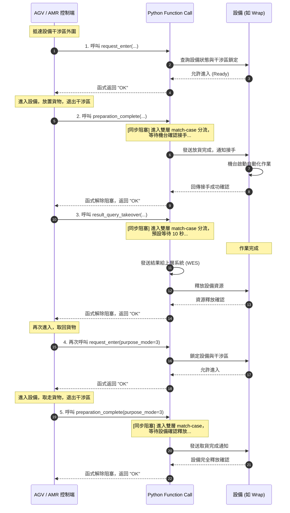

# EAP 設備交握規範 (Python Function Call 介面)

本文件定義 AGV/AMR、EAP (Equipment Automation Protocol) 與各生產設備 (Equipment) 之間的訊號交握流程與 Python Function Call 介面規範，以確保物流搬運過程的流暢性與資源排他性。

交握邏輯採用 **同步式等待 (Sync Blocking Wait)** 設計，呼叫端 (AGV/AMR 控制程式) 呼叫函式後會阻塞等待，直到取得機台回傳的對應確認訊號或處理結果。

---

## 1. 支援設備類型、目的與模式 (Equipment Types, Purpose Modes)

| machine_type | 設備名稱     | purpose mode | purpose mode 說明 | other args for request_enter                  | return result from result_query_takeover  |
| ------------ | -------- | ------------ | --------------- | --------------------------------------------- | ----------------------------------------- |
| Wrap         | 包膜機      | 1            | Pre_Wrap 進入     | -                                             | isOK/Wait                                 |
| Wrap         | 包膜機      | 2            | Full_Wrap 進入    | -                                             | isOK/Wait                                 |
| Wrap         | 包膜機      | 3            | 完工取貨            | -                                             | isOK/Wait                                 |
| Check        | 檢查站/檢驗設備 | 1            | 檢測進出            | -                                             | isOK/Wait, result, okNG, highLow,palletNo |
| Aligner      | 對齊/糾偏機   | 1            | 入料申請            | -                                             | isOK/Wait, result, okNG, highLow,palletNo |
| Aligner      | 對齊/糾偏機   | 2            | 出料申請            | -                                             | isOK/Wait                                 |
| PalletSupply | 棧板供收機    | 1            | 進單板             | -                                             | isOK/Wait, 最底層 palletNo                   |
| PalletSupply | 棧板供收機    | 2            | 進滿板             | -                                             | isOK/Wait, 最底層 palletNo                   |
| PalletSupply | 棧板供收機    | 3            | 出單版             | -                                             | isOK/Wait, 最底層 palletNo                   |
| PalletSupply | 棧板供收機    | 4            | 出滿版             | -                                             | isOK/Wait, 最底層 palletNo                   |
| ASRS_IPORT   | ASRS 入口區 | 1            | 進入放貨(滿架)        | PalletNo,CargoHeight(貨物高度), RackInPlace(空架到位) | isOK/Wait                                 |
| ASRS_IPORT   | ASRS 入口區 | 2            | 進入載空架離開         | RackInPlace(空架到位)                             | isOK/Wait                                 |
| ASRS_OPORT   | ASRS 出口區 | 1            | 進入取貨(滿架)        | -                                             | isOK/Wait,PalletNo                        |
| ASRS_OPORT   | ASRS 出口區 | 2            | 進入放空架           | RackInPlace(空架到位)                             | isOK/Wait                                 |
| LIFT         | 提升機      | 1            | 放貨              | PalletNo,CargoHeight(貨物高度)                    | isOK/Wait                                 |
| LIFT         | 提升機      | 2            | 取貨              | -                                             | isOK/Wait,PalletNo                        |

補充調整:

1. 參考上表，實作所有機台與目的模式的交握流程� ```python
   def request_enter(
   equipment_type: str,
   wes_id: str,
   purpose_mode: int,
   \*\*kwargs
   ) -> str:
   """
   申請進入設備。
   
       :param equipment_type: 設備類型 (Wrap, Check, Aligner, PalletSupply, ASRS_IPORT, ASRS_OPORT, LIFT)
       :param wes_id: WES_ID
       :param purpose_mode: 申請目的模式
       :param kwargs: 機台特有額外引數 (如 pallet_no, cargo_height, rack_in_place)
       :return: "OK" (允許進入) 或 "WAIT" (設備忙碌，須在等待區待命)
       """

```
- **核心分流邏輯 (基於雙層 match-case)**：
```python
pallet_no = kwargs.get("pallet_no", "")
cargo_height = kwargs.get("cargo_height", "")
rack_in_place = kwargs.get("rack_in_place", False)

match equipment_type:
    case "Wrap":
        match purpose_mode:
            case 1:
                logger.info("  -> [Match-Case] [Wrap] 包膜機 (1: Pre_Wrap 進入)，模擬等待 3 秒...")
                time.sleep(3)
                return "OK"
            # 其餘模式依此類推
    case "ASRS_IPORT":
        match purpose_mode:
            case 1:
                logger.info(f"  -> [Match-Case] [ASRS_IPORT] (1: 進入放貨)，驗證參數: PalletNo={pallet_no}")
                time.sleep(3)
                return "OK"
```�作**：

```python
def request_enter(
     equipment_type: str,
     wes_id: str,
    purpose_mode: int
) -> str:
    """
    申請進入設備。

    :param equipment_type: 設備類型 (Wrap, Check, Aligner, PalletSupply)
    :param wes_id: WES_ID
    :param purpose_mode: 申請目的模式 (1=預包膜, 2=全包膜, 3=單板進出, 4=整板進出)
    :return: "OK" (允許進入) 或 "WAIT" (設備忙碌，須在等待區待命)
    """
```

- **核心分流邏輯 (基於雙層 match-case)**：
  
  ```python
  match equipment_type:
      case "Wrap":
          match purpose_mode:
              case 1:
                  print("  -> [Match-Case] 進入 [Wrap] 包膜機分支 (1: 預包膜)，預設等待作業 3 秒...")
                  time.sleep(3)
                  return "OK"
              case 2:
                  print("  -> [Match-Case] 進入 [Wrap] 包膜機分支 (2: 全包膜)，預設等待作業 3 秒...")
                  time.sleep(3)
                  return "OK"
              case _:
                  print(f"  -> [Match-Case] 進入 [Wrap] 包膜機分支 (未知模式 {purpose_mode})，預設等待作業 3 秒...")
                  time.sleep(3)
                  return "OK"
      # 其餘 Check、Aligner、PalletSupply 依此類推
  ```

---

### ［2］ 準備完成通知 (Preparation Complete)

- **目的**：AGV/AMR 進入機台完成貨物放置/取走動作，且車體已完全退出機台干涉區後，通知機台已完成動作，以便機台接手後續的自動化作業。

- **交握設計 (同步式等待)**：
  
  - 本函式採用**同步阻塞等待**。當 AGV/AMR 完成放貨並退至安全區後呼叫此函式。
  - 函式會依據 `equipment_type` 與 `purpose_mode` 雙層 `match-case` 分流，並阻塞執行緒，等待機台接手確認。

- **Python 函式簽章與實作**：
  
  ```python
  def preparation_complete(
      equipment_type: str,
      wes_id: str,
      purpose_mode: int
  ) -> str:
      """
      通知準備完成，並同步等待機台確認接手。
  
      :param equipment_type: 設備類型 (Wrap, Check, Aligner, PalletSupply, ASRS_IPORT, ASRS_OPORT, LIFT)
      :param wes_id: WES_ID
      :param purpose_mode: 申請目的模式
      :return: "OK" 或 "WAIT"
      """
  ```

- **核心分流邏輯**：
  
  ```python
  match equipment_type:
      case "Wrap":
          match purpose_mode:
              case 1 | 2 | 3:
                  logger.info(f"  -> [Match-Case] [Wrap] 準備完成通知 (模式 {purpose_mode})，模擬等待 3 秒...")
                  time.sleep(3)
                  return "OK"
  ```

---

### ［3］ 等待處理結果並接手 (ResultQuery_TakeOver)

- **目的**：交接給機台後，同步等待機台完成對應動作。在此函式中，我們針對不同的設備類型與 `purpose_mode` 使用 Python 3.10 `match-case` 進行雙層分流，預設延遲 10 秒後自動完成，並在回報上游系統後釋放設備資源，以便 AGV 再次進入取貨。

- **Python 函式簽章與實作**：
  
  ```python
  def result_query_takeover(
      equipment_type: str,
      wes_id: str,
      purpose_mode: int
  ) -> dict:
      """
      同步等待設備處理結果，並依據設備與 purpose_mode 進行分流。
  
      :param equipment_type: 設備類型 (Wrap, Check, Aligner, PalletSupply, ASRS_IPORT, ASRS_OPORT, LIFT)
      :param wes_id: WES_ID
      :param purpose_mode: 申請目的模式
      :return: 字典格式結果 (包含 status, palletNo, okNG, highLow, result 等多元資訊)
      """
  ```

- **核心分流邏輯**：
  
  ```python
  match equipment_type:
      case "Check":
          match purpose_mode:
              case 1:
                  logger.info("  -> [Match-Case] [Check] 開始檢驗同步等待，模擬等待 3 秒...")
                  time.sleep(3)
                  return {
                      "status": "OK",
                      "result": "Checked",
                      "okNG": "OK",
                      "highLow": "Normal",
                      "palletNo": f"PLT_CHECK_{wes_id}"
                  }
  ```

---

## 3. 同步交握時序圖 (Interaction Flow)

以下展示完整的 AGV/AMR 運送貨物至機台、同步等待機台處理、並再次進入取貨的 Python 同步呼叫交握時序：



---

## 4. 完整 Python 實作程式碼 (equip_handshaking.py)

以下是與本規範完全對齊的可執行 Python 範例程式碼：[]()

```python
import time
import logging


# ==============================================================================
# 配置 Logger (同時記錄到 handshaking.log 與 Console)
# ==============================================================================
logger = logging.getLogger("handshaking")
logger.setLevel(logging.INFO)

# 避免重複添加 handlers
if not logger.handlers:
    # 檔案 Handler (有時間戳記與日誌等級格式)
    fh = logging.FileHandler("handshaking.log", encoding="utf-8")
    fh.setFormatter(logging.Formatter('%(asctime)s - %(levelname)s - %(message)s'))
    logger.addHandler(fh)

    # 控制台 Handler (保持原本乾淨的模擬輸出)
    ch = logging.StreamHandler()
    ch.setFormatter(logging.Formatter('%(message)s'))
    logger.addHandler(ch)


def request_enter(equipment_type: str, wes_id: str, purpose_mode: int, **kwargs) -> str:
    """
    ［1］ 申請進入設備 (Request Enter)
    :param equipment_type: 設備類型 (Wrap, Check, Aligner, PalletSupply, ASRS_IPORT, ASRS_OPORT, LIFT)
    :param wes_id: WES_ID
    :param purpose_mode: 申請目的模式
    :param kwargs: 機台特有引數，如 pallet_no (str), cargo_height (str), rack_in_place (bool)
    :return: "OK" 或 "WAIT"
    """
    pallet_no = kwargs.get("pallet_no", "")
    cargo_height = kwargs.get("cargo_height", "")
    rack_in_place = kwargs.get("rack_in_place", False)

    logger.info(f"\n[RequestEnter] 申請進入設備 ({equipment_type}) ID: {wes_id}, 目的模式: {purpose_mode}...")
    if kwargs:
        logger.info(f"  -> 攜帶參數: pallet_no={pallet_no}, cargo_height={cargo_height}, rack_in_place={rack_in_place}")

    match equipment_type:
        case "Wrap":
            match purpose_mode:
                case 1:
                    logger.info("  -> [Match-Case] [Wrap] 包膜機 (1: Pre_Wrap 進入)，模擬等待 3 秒...")
                    time.sleep(3)
                    return "OK"
                case 2:
                    logger.info("  -> [Match-Case] [Wrap] 包膜機 (2: Full_Wrap 進入)，模擬等待 3 秒...")
                    time.sleep(3)
                    return "OK"
                case 3:
                    logger.info("  -> [Match-Case] [Wrap] 包膜機 (3: 完工取貨)，模擬等待 3 秒...")
                    time.sleep(3)
                    return "OK"
                case _:
                    logger.info(f"  -> [Match-Case] [Wrap] 未知模式 {purpose_mode}，模擬等待 3 秒...")
                    time.sleep(3)
                    return "OK"

        case "Check":
            match purpose_mode:
                case 1:
                    logger.info("  -> [Match-Case] [Check] 檢驗設備 (1: 檢測進出)，模擬等待 3 秒...")
                    time.sleep(3)
                    return "OK"
                case _:
                    logger.info(f"  -> [Match-Case] [Check] 未知模式 {purpose_mode}，模擬等待 3 秒...")
                    time.sleep(3)
                    return "OK"

        case "Aligner":
            match purpose_mode:
                case 1:
                    logger.info("  -> [Match-Case] [Aligner] 糾偏機 (1: 入料申請)，模擬等待 3 秒...")
                    time.sleep(3)
                    return "OK"
                case 2:
                    logger.info("  -> [Match-Case] [Aligner] 糾偏機 (2: 出料申請)，模擬等待 3 秒...")
                    time.sleep(3)
                    return "OK"
                case _:
                    logger.info(f"  -> [Match-Case] [Aligner] 未知模式 {purpose_mode}，模擬等待 3 秒...")
                    time.sleep(3)
                    return "OK"

        case "PalletSupply":
            match purpose_mode:
                case 1:
                    logger.info("  -> [Match-Case] [PalletSupply] 棧板供收機 (1: 取單板)，模擬等待 3 秒...")
                    time.sleep(3)
                    return "OK"
                case 2:
                    logger.info("  -> [Match-Case] [PalletSupply] 棧板供收機 (2: 收單板)，模擬等待 3 秒...")
                    time.sleep(3)
                    return "OK"
                case 3:
                    logger.info("  -> [Match-Case] [PalletSupply] 棧板供收機 (3: 供滿版)，模擬等待 3 秒...")
                    time.sleep(3)
                    return "OK"
                case 4:
                    logger.info("  -> [Match-Case] [PalletSupply] 棧板供收機 (4: 收滿版)，模擬等待 3 秒...")
                    time.sleep(3)
                    return "OK"
                case _:
                    logger.info(f"  -> [Match-Case] [PalletSupply] 未知模式 {purpose_mode}，模擬等待 3 秒...")
                    time.sleep(3)
                    return "OK"

        case "ASRS_IPORT":
            match purpose_mode:
                case 1:
                    logger.info(f"  -> [Match-Case] [ASRS_IPORT] 入口區 (1: 進入放貨-滿架)，驗證參數: PalletNo={pallet_no}, 貨物高度={cargo_height}, 空架到位={rack_in_place}，模擬等待 3 秒...")
                    time.sleep(3)
                    return "OK"
                case 2:
                    logger.info("  -> [Match-Case] [ASRS_IPORT] 入口區 (2: 進入載空架離開)，模擬等待 3 秒...")
                    time.sleep(3)
                    return "OK"
                case _:
                    logger.info(f"  -> [Match-Case] [ASRS_IPORT] 未知模式 {purpose_mode}，模擬等待 3 秒...")
                    time.sleep(3)
                    return "OK"

        case "ASRS_OPORT":
            match purpose_mode:
                case 1:
                    logger.info("  -> [Match-Case] [ASRS_OPORT] 出口區 (1: 進入取貨-滿架)，模擬等待 3 秒...")
                    time.sleep(3)
                    return "OK"
                case 2:
                    logger.info(f"  -> [Match-Case] [ASRS_OPORT] 出口區 (2: 進入放空架)，驗證參數: 空架到位={rack_in_place}，模擬等待 3 秒...")
                    time.sleep(3)
                    return "OK"
                case _:
                    logger.info(f"  -> [Match-Case] [ASRS_OPORT] 未知模式 {purpose_mode}，模擬等待 3 秒...")
                    time.sleep(3)
                    return "OK"

        case "LIFT":
            match purpose_mode:
                case 1:
                    logger.info(f"  -> [Match-Case] [LIFT] 提升機 (1: 放貨)，驗證參數: PalletNo={pallet_no}, 貨物高度={cargo_height}，模擬等待 3 秒...")
                    time.sleep(3)
                    return "OK"
                case 2:
                    logger.info("  -> [Match-Case] [LIFT] 提升機 (2: 取貨)，模擬等待 3 秒...")
                    time.sleep(3)
                    return "OK"
                case _:
                    logger.info(f"  -> [Match-Case] [LIFT] 未知模式 {purpose_mode}，模擬等待 3 秒...")
                    time.sleep(3)
                    return "OK"

        case _:
            logger.info(f"  -> [Match-Case] 未知設備類型 {equipment_type}，預設模擬等待 3 秒...")
            time.sleep(3)
            return "OK"


def preparation_complete(equipment_type: str, wes_id: str, purpose_mode: int) -> str:
    """
    ［2］ 準備完成通知 (Preparation Complete) - 同步式等待
    :param equipment_type: 設備類型 (Wrap, Check, Aligner, PalletSupply, ASRS_IPORT, ASRS_OPORT, LIFT)
    :param wes_id: WES_ID
    :param purpose_mode: 申請目的模式
    :return: "OK" 或 "WAIT"
    """
    logger.info(f"\n[PreparationComplete] 設備 ({equipment_type}) ID: {wes_id}, 目的模式: {purpose_mode} 準備完成通知，等待確認...")
    match equipment_type:
        case "Wrap":
            match purpose_mode:
                case 1 | 2 | 3:
                    logger.info(f"  -> [Match-Case] [Wrap] 準備完成通知 (模式 {purpose_mode})，模擬等待 3 秒...")
                    time.sleep(3)
                    return "OK"
                case _:
                    logger.info(f"  -> [Match-Case] [Wrap] 準備完成通知 (未知模式 {purpose_mode})，模擬等待 3 秒...")
                    time.sleep(3)
                    return "OK"

        case "Check":
            match purpose_mode:
                case 1:
                    logger.info("  -> [Match-Case] [Check] 準備完成通知 (模式 1)，模擬等待 3 秒...")
                    time.sleep(3)
                    return "OK"
                case _:
                    logger.info("  -> [Match-Case] [Check] 未知模式，模擬等待 3 秒...")
                    time.sleep(3)
                    return "OK"

        case "Aligner":
            match purpose_mode:
                case 1:
                    logger.info("  -> [Match-Case] [Aligner] 準備完成通知 (模式 1: 入料準備完成)，模擬等待 3 秒...")
                    time.sleep(3)
                    return "OK"
                case 2:
                    logger.info("  -> [Match-Case] [Aligner] 準備完成通知 (模式 2: 出料準備完成)，模擬等待 3 秒...")
                    time.sleep(3)
                    return "OK"
                case _:
                    logger.info("  -> [Match-Case] [Aligner] 未知模式，模擬等待 3 秒...")
                    time.sleep(3)
                    return "OK"

        case "PalletSupply":
            match purpose_mode:
                case 1 | 2 | 3 | 4:
                    logger.info(f"  -> [Match-Case] [PalletSupply] 準備完成通知 (模式 {purpose_mode})，模擬等待 3 秒...")
                    time.sleep(3)
                    return "OK"
                case _:
                    logger.info("  -> [Match-Case] [PalletSupply] 未知模式，模擬等待 3 秒...")
                    time.sleep(3)
                    return "OK"

        case "ASRS_IPORT":
            match purpose_mode:
                case 1:
                    logger.info("  -> [Match-Case] [ASRS_IPORT] 準備完成通知 (模式 1: 放貨完成)，模擬等待 3 秒...")
                    time.sleep(3)
                    return "OK"
                case 2:
                    logger.info("  -> [Match-Case] [ASRS_IPORT] 準備完成通知 (模式 2: 載空架離開完成)，模擬等待 3 秒...")
                    time.sleep(3)
                    return "OK"
                case _:
                    logger.info("  -> [Match-Case] [ASRS_IPORT] 未知模式，模擬等待 3 秒...")
                    time.sleep(3)
                    return "OK"

        case "ASRS_OPORT":
            match purpose_mode:
                case 1:
                    logger.info("  -> [Match-Case] [ASRS_OPORT] 準備完成通知 (模式 1: 取貨完成)，模擬等待 3 秒...")
                    time.sleep(3)
                    return "OK"
                case 2:
                    logger.info("  -> [Match-Case] [ASRS_OPORT] 準備完成通知 (模式 2: 放空架完成)，模擬等待 3 秒...")
                    time.sleep(3)
                    return "OK"
                case _:
                    logger.info("  -> [Match-Case] [ASRS_OPORT] 未知模式，模擬等待 3 秒...")
                    time.sleep(3)
                    return "OK"

        case "LIFT":
            match purpose_mode:
                case 1:
                    logger.info("  -> [Match-Case] [LIFT] 準備完成通知 (模式 1: 放貨完成)，模擬等待 3 秒...")
                    time.sleep(3)
                    return "OK"
                case 2:
                    logger.info("  -> [Match-Case] [LIFT] 準備完成通知 (模式 2: 取貨完成)，模擬等待 3 秒...")
                    time.sleep(3)
                    return "OK"
                case _:
                    logger.info("  -> [Match-Case] [LIFT] 未知模式，模擬等待 3 秒...")
                    time.sleep(3)
                    return "OK"

        case _:
            logger.info(f"  -> [Match-Case] 未知設備 {equipment_type} 準備完成，預設模擬等待 3 秒...")
            time.sleep(3)
            return "OK"


def result_query_takeover(equipment_type: str, wes_id: str, purpose_mode: int) -> dict:
    """
    ［3］ 等待處理結果並接手 (ResultQuery_TakeOver) - 同步式等待
    :param equipment_type: 設備類型 (Wrap, Check, Aligner, PalletSupply, ASRS_IPORT, ASRS_OPORT, LIFT)
    :param wes_id: WES_ID
    :param purpose_mode: 申請目的模式
    :return: 字典格式結果 (包含 status, palletNo, okNG, highLow, result 等)
    """
    logger.info(f"\n[ResultQuery_TakeOver] 設備 ({equipment_type}) ID: {wes_id}, 目的模式: {purpose_mode} 開始同步等待結果...")
    match equipment_type:
        case "Wrap":
            match purpose_mode:
                case 1 | 2 | 3:
                    logger.info(f"  -> [Match-Case] [Wrap] 開始同步等待結果，模式: {purpose_mode}，模擬等待 3 秒...")
                    time.sleep(3)
                    logger.info(f"  -> [Wrap] 作業完成，回報 WES (ID: {wes_id}) 並釋放設備資源。")
                    return {"status": "OK"}
                case _:
                    time.sleep(3)
                    return {"status": "OK"}

        case "Check":
            match purpose_mode:
                case 1:
                    logger.info("  -> [Match-Case] [Check] 開始檢驗同步等待，模式: 1，模擬等待 3 秒...")
                    time.sleep(3)
                    result_data = {
                        "status": "OK",
                        "result": "Checked",
                        "okNG": "OK",
                        "highLow": "Normal",
                        "palletNo": f"PLT_CHECK_{wes_id}"
                    }
                    logger.info(f"  -> [Check] 檢驗作業完成，結果: {result_data}，回報 WES 並釋放資源。")
                    return result_data
                case _:
                    time.sleep(3)
                    return {"status": "OK"}

        case "Aligner":
            match purpose_mode:
                case 1:
                    logger.info("  -> [Match-Case] [Aligner] 開始糾偏同步等待，模式: 1，模擬等待 3 秒...")
                    time.sleep(3)
                    result_data = {
                        "status": "OK",
                        "result": "Aligned",
                        "okNG": "OK",
                        "highLow": "Normal",
                        "palletNo": f"PLT_ALIGN_{wes_id}"
                    }
                    logger.info(f"  -> [Aligner] 糾偏作業完成，結果: {result_data}，回報 WES 並釋放資源。")
                    return result_data
                case 2:
                    logger.info("  -> [Match-Case] [Aligner] 出料同步等待，模式: 2，模擬等待 3 秒...")
                    time.sleep(3)
                    return {"status": "OK"}
                case _:
                    time.sleep(3)
                    return {"status": "OK"}

        case "PalletSupply":
            match purpose_mode:
                case 1 | 2 | 3 | 4:
                    logger.info(f"  -> [Match-Case] [PalletSupply] 開始棧板供收同步等待，模式: {purpose_mode}，模擬等待 3 秒...")
                    time.sleep(3)
                    result_data = {
                        "status": "OK",
                        "palletNo": f"PLT_SUPPLY_BOTTOM_{wes_id}"
                    }
                    logger.info(f"  -> [PalletSupply] 棧板作業完成，結果: {result_data}，回報 WES 並釋放資源。")
                    return result_data
                case _:
                    time.sleep(3)
                    return {"status": "OK"}

        case "ASRS_IPORT":
            match purpose_mode:
                case 1:
                    logger.info("  -> [Match-Case] [ASRS_IPORT] 入庫放貨同步等待，模式: 1，模擬等待 3 秒...")
                    time.sleep(3)
                    logger.info("  -> [ASRS_IPORT] 入庫作業完成，回報 WES 並釋放資源。")
                    return {"status": "OK"}
                case 2:
                    logger.info("  -> [Match-Case] [ASRS_IPORT] 載空架離開同步等待，模式: 2，模擬等待 3 秒...")
                    time.sleep(3)
                    logger.info("  -> [ASRS_IPORT] 作業完成，回報 WES 並釋放資源。")
                    return {"status": "OK"}
                case _:
                    time.sleep(3)
                    return {"status": "OK"}

        case "ASRS_OPORT":
            match purpose_mode:
                case 1:
                    logger.info("  -> [Match-Case] [ASRS_OPORT] 取貨同步等待，模式: 1，模擬等待 3 秒...")
                    time.sleep(3)
                    result_data = {
                        "status": "OK",
                        "palletNo": f"PLT_ASRS_OUT_{wes_id}"
                    }
                    logger.info(f"  -> [ASRS_OPORT] 取貨出庫完成，結果: {result_data}，回報 WES 並釋放出口工位資源。")
                    return result_data
                case 2:
                    logger.info("  -> [Match-Case] [ASRS_OPORT] 放空架同步等待，模式: 2，模擬等待 3 秒...")
                    time.sleep(3)
                    logger.info("  -> [ASRS_OPORT] 空架放置完成，回報 WES 並釋放工位資源。")
                    return {"status": "OK"}
                case _:
                    time.sleep(3)
                    return {"status": "OK"}

        case "LIFT":
            match purpose_mode:
                case 1:
                    logger.info("  -> [Match-Case] [LIFT] 放貨同步等待，模式: 1，模擬等待 3 秒...")
                    time.sleep(3)
                    logger.info("  -> [LIFT] 貨物已送達目標樓層，回報 WES 並釋放提升機資源。")
                    return {"status": "OK"}
                case 2:
                    logger.info("  -> [Match-Case] [LIFT] 取貨同步等待，模式: 2，模擬等待 3 秒...")
                    time.sleep(3)
                    result_data = {
                        "status": "OK",
                        "palletNo": f"PLT_LIFT_OUT_{wes_id}"
                    }
                    logger.info(f"  -> [LIFT] 取貨交接完成，結果: {result_data}，回報 WES 並釋放資源。")
                    return result_data
                case _:
                    time.sleep(3)
                    return {"status": "OK"}

        case _:
            time.sleep(3)
            logger.info(f"  -> [Match-Case] 未知設備類型 {equipment_type}，回報 WES 並釋放資源。")
            return {"status": "OK"}


# ==============================================================================
# 模擬執行流程 (Simulation Workflow)
# ==============================================================================
def run_simulation():
    logger.info("==================================================")
    logger.info("      開始 EAP 設備交握流程模擬 (Mock Mode)       ")
    logger.info("==================================================")

    # 場景 1: Wrap 包膜機流程 (模式 1 (預包) -> 完成 -> 等待結果 -> 模式 3 (完工取貨) -> 完工準備完成)
    logger.info("\n>>> [場景 1] 模擬 AGV 至 Wrap 包膜機放貨並取貨...")
    wes_id_1 = "WES_WRAP_99"
    if request_enter(equipment_type="Wrap", wes_id=wes_id_1, purpose_mode=1) == "OK":
        logger.info("  >>> AGV 進入 Wrap 干涉區，執行放貨作業...")
        time.sleep(0.5)
        logger.info("  >>> AGV 完成放貨，退回安全區域。")

        if preparation_complete(equipment_type="Wrap", wes_id=wes_id_1, purpose_mode=1) == "OK":
            res = result_query_takeover(equipment_type="Wrap", wes_id=wes_id_1, purpose_mode=1)
            if res.get("status") == "OK":
                logger.info("  >>> 包膜作業完成且資源已釋放。AGV 準備重新進入取貨...")

                # 重新申請進入取貨 (mode 3)
                if request_enter(equipment_type="Wrap", wes_id=wes_id_1, purpose_mode=3) == "OK":
                    logger.info("  >>> AGV 重新進入 Wrap 執行取貨...")
                    time.sleep(0.5)
                    logger.info("  >>> AGV 完成取貨，攜帶貨物退出安全區域。")
                    preparation_complete(equipment_type="Wrap", wes_id=wes_id_1, purpose_mode=3)
                    logger.info("  >>> [場景 1] 成功結束。")

    # 場景 2: Check 檢驗站流程 (模式 1 (檢測進出))
    logger.info("\n>>> [場景 2] 模擬 AGV 至 Check 檢驗站進行檢驗...")
    wes_id_2 = "WES_CHECK_88"
    if request_enter(equipment_type="Check", wes_id=wes_id_2, purpose_mode=1) == "OK":
        logger.info("  >>> AGV 進入 Check 干涉區放貨並離開...")
        time.sleep(0.5)
        if preparation_complete(equipment_type="Check", wes_id=wes_id_2, purpose_mode=1) == "OK":
            res = result_query_takeover(equipment_type="Check", wes_id=wes_id_2, purpose_mode=1)
            logger.info(f"  >>> [場景 2] 成功結束，取得檢驗結果: {res}")

    # 場景 3: ASRS_IPORT 入庫流程 (模式 1)
    logger.info("\n>>> [場景 3] 模擬 AGV 前往 ASRS 入口區放貨...")
    wes_id_3 = "WES_ASRS_IN_77"
    # 傳入 extra arguments
    if request_enter(
        equipment_type="ASRS_IPORT",
        wes_id=wes_id_3,
        purpose_mode=1,
        pallet_no="PLT_ASRS_001",
        cargo_height="Low",
        rack_in_place=True
    ) == "OK":
        logger.info("  >>> AGV 進入 ASRS 入口區執行放貨...")
        time.sleep(0.5)
        if preparation_complete(equipment_type="ASRS_IPORT", wes_id=wes_id_3, purpose_mode=1) == "OK":
            res = result_query_takeover(equipment_type="ASRS_IPORT", wes_id=wes_id_3, purpose_mode=1)
            logger.info(f"  >>> [場景 3] 成功結束，結果: {res}")

    # 場景 4: Aligner 糾偏機流程
    logger.info("\n>>> [場景 4] 模擬 AGV 至 Aligner 糾偏機進行入料與出料...")
    wes_id_4 = "WES_ALIGN_55"
    # 1. 申請入料 (purpose_mode=1)
    if request_enter(equipment_type="Aligner", wes_id=wes_id_4, purpose_mode=1) == "OK":
        logger.info("  >>> AGV 進入 Aligner 干涉區，執行放貨作業...")
        time.sleep(0.5)
        logger.info("  >>> AGV 完成放貨，退回安全區域。")

        # 2. 入料準備完成
        if preparation_complete(equipment_type="Aligner", wes_id=wes_id_4, purpose_mode=1) == "OK":
            # 3. 入料同步等待結果 (在此取得糾偏結果)
            res1 = result_query_takeover(equipment_type="Aligner", wes_id=wes_id_4, purpose_mode=1)
            logger.info(f"  >>> 取得糾偏入料檢測結果: {res1}")
            if res1.get("status") == "OK":
                logger.info("  >>> 糾偏作業完成。AGV 準備申請出料取貨...")
                time.sleep(0.5)

                # 4. 申請出料 (purpose_mode=2)
                if request_enter(equipment_type="Aligner", wes_id=wes_id_4, purpose_mode=2) == "OK":
                    logger.info("  >>> AGV 重新進入 Aligner 執行取貨...")
                    time.sleep(0.5)
                    logger.info("  >>> AGV 完成取貨，退出安全區域。")

                    # 5. 出料準備完成
                    if preparation_complete(equipment_type="Aligner", wes_id=wes_id_4, purpose_mode=2) == "OK":
                        # 6. 出料等待結果並接手
                        res2 = result_query_takeover(equipment_type="Aligner", wes_id=wes_id_4, purpose_mode=2)
                        logger.info(f"  >>> [場景 4] 成功結束，取得出料結果: {res2}")


if __name__ == "__main__":
    run_simulation()
```

_mode:
case 1 | 2:
print(f" -> [Match-Case] [Wrap] 包膜同步等待，模式 {purpose_mode}，預設等待 10 秒...")
time.sleep(3)
print(" -> [Wrap] 包膜作業完成，成功回報 WES 並釋放資源。")
return "OK"
case _:
time.sleep(3)
print(f" -> [Wrap] 作業完成 (模式 {purpose*mode})，釋放資源。")
return "OK"
case "Check":
match purpose_mode:
case 1:
time.sleep(3)
print(" -> [Check] 檢驗作業完成，成功回報 WES 並釋放資源。")
return "OK"
case "Aligner":
match purpose_mode:
case 1:
time.sleep(3)
print(" -> [Aligner] 糾偏作業完成，成功回報 WES 並釋放資源。")
return "OK"
case "PalletSupply":
match purpose_mode:
case 1 | 2:
time.sleep(3)
print(f" -> [PalletSupply] 棧板作業完成 (模式 {purpose_mode})，回報 WES 並釋放資源。")
return "OK"
case "ASRS_OPORT":
match purpose_mode:
case 1 | 2:
time.sleep(3)
print(f" -> [ASRS_OPORT] 出庫作業完成 (模式 {purpose_mode})，成功回報 WES 並釋放出口工位資源。")
return "OK"
case *:
time.sleep(3)
print(f" -> [ASRS_OPORT] 出庫作業完成 (模式 {purpose*mode})，釋放資源。")
return "OK"
case *:
time.sleep(3)
print(f" -> 未知設備類型 {equipment_type}，成功回報 WES 並釋放資源。")
return "OK"

    return "OK"

==============================================================================

模擬執行流程 (Simulation Workflow)

==============================================================================

def run_simulation():
print("==================================================")
print(" 開始 EAP 設備交握流程模擬 (Mock Mode) ")
print("==================================================")

    wes_task_id = "WES_ID01"
    
    # 步驟 1: AGV 抵達，申請進入設備放貨 (purpose_mode=1: 預包膜)
    if request_enter(equipment_type="Wrap", wes_id=wes_task_id, purpose_mode=1) == "OK":
        print("\n>>> AGV 進入干涉區，執行放貨作業...")
        time.sleep(0.5)  # 模擬放貨物理時間
        print(">>> AGV 完成放貨，退回安全區域。")
    
        # 步驟 2: 通知準備完成 (同步等待機台接手)
        if preparation_complete(equipment_type="Wrap", wes_id=wes_task_id, purpose_mode=1) == "OK":
            # 步驟 3: 同步等待設備處理結果並接手 (預設 sleep 10 秒)
            if result_query_takeover(equipment_type="Wrap", wes_id=wes_task_id, purpose_mode=1) == "OK":
                print("\n>>> 設備處理完成且資源已釋放。AGV 準備重新進入接手取貨...")
    
                # 步驟 4: 重新申請進入取貨 (purpose_mode=3: 單板進出)
                if request_enter(equipment_type="Wrap", wes_id=wes_task_id, purpose_mode=3) == "OK":
                    print("\n>>> AGV 重新進入干涉區，執行取貨作業...")
                    time.sleep(0.5)  # 模擬取貨物理時間
                    print(">>> AGV 完成取貨，攜帶貨物退出安全區域。")
    
                    # 步驟 5: 通知取貨完成
                    preparation_complete(equipment_type="Wrap", wes_id=wes_task_id, purpose_mode=3)
                    print("\n>>> 任務交握流程順利結束，釋放設備資源。")
                else:
                    print("設備拒絕再次進入，停止模擬。")
            else:
                print("等待設備處理結果失敗。")
        else:
            print("機台接手失敗。")
    else:
        print("設備拒絕進入，停止模擬. ")

if **name** == "**main**":
run_simulation()

```
---

## 5. Web HTTP RESTful API 介面規範

為了讓 Python Function Call 呼叫模式能與 Web API 存取模式並存，我們使用 **FastAPI** 框架建立了一個獨立的 Web 服務 ([app.py](file:///c:/Sean_Documents/equip_handshaking/app.py))。此服務直接匯入並調用底層的核心交握函式。

### 5.1 啟動 API 服務

1. **安裝必要依賴**：
   ```bash
   pip install fastapi uvicorn pydantic
```

2. **啟動 API 伺服器**：
   
   ```bash
   python app.py
   ```
   
   啟動後，伺服器預設會聆聽 `http://localhost:8000`。您可瀏覽 `http://localhost:8000/docs` 查看自動生成的互動式 API Swagger 文件。

### 5.2 API 介面規格

所有 API 均採用 **HTTP POST** 方法傳遞 JSON 資料結構，其請求 Body 與回應 Body 規格如下：

#### 請求 Body 格式 (JSON)

```json
{
  "equipment_type": "ASRS_IPORT",
  "wes_id": "WES_ID01",
  "purpose_mode": 1,
  "extra_args": {
    "pallet_no": "PLT_ASRS_001",
    "cargo_height": "High",
    "rack_in_place": true
  }
}
```

- `equipment_type` (string): 設備類型 (`Wrap`, `Check`, `Aligner`, `PalletSupply`, `ASRS_IPORT`, `ASRS_OPORT`, `LIFT`)。
- `wes_id` (string): WES 任務 ID。
- `purpose_mode` (integer): 申請目的模式。
- `extra_args` (object, optional): 機台特有額外引數。

#### 回應 Body 格式 (JSON)

對於 `/api/request-enter` 與 `/api/preparation-complete`：

```json
{
  "status": "OK"
}
```

對於 `/api/result-query-takeover`，會回傳含有多個檢測或棧板資訊的 JSON 物件：

```json
{
  "status": "OK",
  "palletNo": "PLT_ASRS_OUT_WES_ID01",
  "okNG": "OK",
  "highLow": "Normal",
  "result": "Success"
}
```

---

### 5.3 API 端點列表

#### 1. 申請進入設備 (Request Enter)

- **端點**：`/api/request-enter`
- **方法**：`POST`
- **說明**：AGV 申請進入物理干涉區。會同步阻塞等待 Python 底層函式回傳執行結果。

#### 2. 準備完成通知 (Preparation Complete)

- **端點**：`/api/preparation-complete`
- **方法**：`POST`
- **說明**：AGV 放貨完成並退出干涉區後，通知設備接手。

#### 3. 等待處理結果並接手 (Result Query Takeover)

- **端點**：`/api/result-query-takeover`
- **方法**：`POST`
- **說明**：同步等待設備處理結果，完成後回報並釋放資源。

---

### 5.4 Web API 實作程式碼 (app.py)

以下是完整的 `app.py` 實作程式碼：

```python
import uvicorn
from fastapi import FastAPI, HTTPException
from pydantic import BaseModel, Field

# 匯入原本的 Python 交握函式
from equip_handshaking import request_enter, preparation_complete, result_query_takeover

app = FastAPI(
    title="EAP 設備交握 API 服務",
    description="提供 AGV/AMR 與 EAP 設備之間的 HTTP RESTful API 交握介面",
    version="1.1.0"
)

# 定義 API 請求的資料格式 (Pydantic Model)
class HandshakeRequest(BaseModel):
    equipment_type: str = Field(
        ...,
        description="設備類型 (Wrap, Check, Aligner, PalletSupply, ASRS_IPORT, ASRS_OPORT, LIFT)",
        json_schema_extra={"example": "Wrap"}
    )
    wes_id: str = Field(
        ...,
        description="WES_ID 任務編號",
        json_schema_extra={"example": "WES_ID01"}
    )
    purpose_mode: int = Field(
        ...,
        description="申請目的模式",
        json_schema_extra={"example": 1}
    )
    extra_args: dict = Field(
        default=None,
        description="機台特有額外引數 (如 pallet_no, cargo_height, rack_in_place)",
        json_schema_extra={"example": {"pallet_no": "P001", "cargo_height": "Low", "rack_in_place": True}}
    )


# 定義 API 回傳格式 (基本版)
class HandshakeResponse(BaseModel):
    status: str = Field(..., description="執行結果 ('OK' 或 'WAIT')")

@app.post("/api/request-enter", response_model=HandshakeResponse, summary="［1］ 申請進入設備")
def api_request_enter(payload: HandshakeRequest):
    try:
        # 呼叫原本的 Python 核心函式，傳入解包後的 extra_args
        kwargs = payload.extra_args if payload.extra_args is not None else {}
        result = request_enter(
            equipment_type=payload.equipment_type,
            wes_id=payload.wes_id,
            purpose_mode=payload.purpose_mode,
            **kwargs
        )
        return HandshakeResponse(status=result)
    except Exception as e:
        raise HTTPException(status_code=500, detail=str(e))

@app.post("/api/preparation-complete", response_model=HandshakeResponse, summary="［2］ 準備完成通知")
def api_preparation_complete(payload: HandshakeRequest):
    try:
        result = preparation_complete(
            equipment_type=payload.equipment_type,
            wes_id=payload.wes_id,
            purpose_mode=payload.purpose_mode
        )
        return HandshakeResponse(status=result)
    except Exception as e:
        raise HTTPException(status_code=500, detail=str(e))

@app.post("/api/result-query-takeover", summary="［3］ 等待處理結果並接手")
def api_result_query_takeover(payload: HandshakeRequest):
    try:
        # 此處回傳為 dict，以支援規格表的多欄位要求
        result = result_query_takeover(
            equipment_type=payload.equipment_type,
            wes_id=payload.wes_id,
            purpose_mode=payload.purpose_mode
        )
        return result
    except Exception as e:
        raise HTTPException(status_code=500, detail=str(e))

if __name__ == "__main__":
    # 啟動 Web Server，聆聽 port 8000
    uvicorn.run("app:app", host="0.0.0.0", port=8000, reload=True)
```

---

### 5.5 ASRS 出口工位 (ASRS_OPORT) API 呼叫交握範例

以下是 AGV 前往 ASRS 出口區取貨的完整 API 交握流程範例：

#### 步驟 1: 申請進入 ASRS 出口工位 (單板出庫取貨)

AGV 抵達 ASRS 出口區外圍，向 Web 服務申請進入取貨。

- **HTTP 請求 (curl)**：
  
  ```bash
  curl -X POST "http://localhost:8000/api/request-enter" \
       -H "Content-Type: application/json" \
       -d '{"equipment_type": "ASRS_OPORT", "wes_id": "WES_ID_ASRS_01", "purpose_mode": 1}'
  ```
- **伺服器端 Log 輸出**：
  
  ```text
  [RequestEnter] 申請進入設備 (ASRS_OPORT) ID: WES_ID_ASRS_01...
    -> [Match-Case] 進入 [ASRS_OPORT] 出口區分支 (1: 單板出庫取貨)，預設等待作業 3 秒...
  ```
- **HTTP 回應** (等待 5 秒後)：
  
  ```json
  {
    "status": "OK"
  }
  ```

#### 步驟 2: 取貨完成通知

AGV 進入出口工位，取走貨物，完全退出干涉區後，通知 ASRS 取貨準備完成。

- **HTTP 請求 (curl)**：
  
  ```bash
  curl -X POST "http://localhost:8000/api/preparation-complete" \
       -H "Content-Type: application/json" \
       -d '{"equipment_type": "ASRS_OPORT", "wes_id": "WES_ID_ASRS_01", "purpose_mode": 1}'
  ```
- **伺服器端 Log 輸出**：
  
  ```text
  [PreparationComplete] 設備 (ASRS_OPORT) 準備完成通知，同步等待機台接手確認...
    -> [Match-Case] [ASRS_OPORT] 取貨準備完成，目的模式 1，預設等待作業 3 秒...
  ```
- **HTTP 回應** (等待 5 秒後)：
  
  ```json
  {
    "status": "OK"
  }
  ```

#### 步驟 3: 同步等待出庫作業完成與釋放

AGV 通知出庫完成後，呼叫此 API 同步等待 ASRS 設備完成資料上報、狀態更新與出口工位資源釋放。

- **HTTP 請求 (curl)**：
  
  ```bash
  curl -X POST "http://localhost:8000/api/result-query-takeover" \
       -H "Content-Type: application/json" \
       -d '{"equipment_type": "ASRS_OPORT", "wes_id": "WES_ID_ASRS_01", "purpose_mode": 1}'
  ```
- **伺服器端 Log 輸出**：
  
  ```text
  [ResultQuery_TakeOver] 設備 (ASRS_OPORT) 開始同步等待作業結果...
    -> [ASRS_OPORT] 出庫作業完成 (模式 1)，成功回報 WES 並釋放出口工位資源。
  ```
- **HTTP 回應** (等待 5 秒後)：
  
  ```json
  {
    "status": "OK"
  }
  ```
