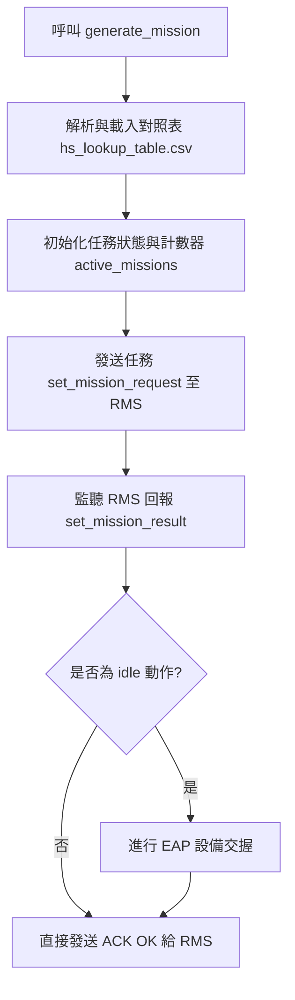

# MOVE 任務交握模組說明文件 (`move.py`)

本文件說明 `move.py` 的整體運作邏輯、交握狀態機設計，以及未來如何將此架構沿用、擴充至正式 WCS 系統中。

---

## 1. `move.py` 運作邏輯

`move.py` 主要模擬 WCS 針對車輛執行搬運（`MOVE`）任務時，控制任務流與設備交握（Handshaking）的核心機制，其處理流程如下：



### A. 任務生成與等待點解析
1. **呼叫 `generate_mission`**：輸入起點 (`sourcepoint`) 與終點 (`targetpoint`)，生成包含 `start`, `idle`, `load`, `unload`, `end` 等步驟的任務 JSON。
2. **解析對照表**：
   - 讀取 `AGV_mission/hs_lookup_table.csv` 的新欄位 `equipment_type` 與 `point_id`（作為 `wes_id`）。
   - 找出起點與終點各自的等待點 `sourcepoint_W` 與 `targetpoint_W`。
3. **初始化任務狀態**：於全域 `active_missions` 字典中，為該任務 sequence 註冊其起迄等待點及交握計數器。

### B. 背景 HTTP Server 監聽
- 啟動背景執行緒，監聽 WCS 的通訊 Port (`31112`)。
- 接收來自 RMS 的結果回報（`/awd/rms/set_mission_result`），並推入安全佇列中依序處理。

### C. 設備交握狀態機
當從佇列取得 `action == "idle"` 時，執行以下邏輯：
1. **判定等待點歸屬與 `purpose_mode`**：
   - 若 `space == sourcepoint_W`：說明為**起點等待點**的交握，`purpose_mode` 設為 **2**。
   - 若 `space == targetpoint_W`：說明為**終點等待點**的交握，`purpose_mode` 設為 **1**。
2. **交握次數判斷（一進一出、分步交握）**：
   - **第 1 次遇見該等待點**：呼叫 `request-enter` (申請進入)。
   - **第 2 次遇見該等待點**：呼叫 `preparation-complete` (通知放置/取走) ＋ `result-query-takeover` (同步阻塞等待完工)。
3. **推進任務**：交握確認完成後，自動發送 `/awd/rms/set_mission_ack` 給 RMS。

## 2. 手動測試與環境搭配

執行 `move.py` 前，需依序在不同的 Terminal 視窗啟動以下三個組件以搭配測試環境：

### 步驟 1：啟動 EAP 設備交握 API 服務 (FastAPI)
此服務模擬實體機台 PLC 的交握反應。
- **執行目錄**：`equip_handshaking`
- **啟動指令**：
  ```bash
  python app.py
  ```
- **監聽 Port**：`8000` (FastAPI)

### 步驟 2：啟動 RMS 模擬器 (RMS Simulator)
此模擬器接收 WCS 的派工，並非同步回報車輛的步驟執行結果 (`set_mission_result`)。
- **執行目錄**：專案根目錄
- **啟動指令**：
  ```bash
  python rms_simulator.py
  ```
- **監聽 Port**：`31111` (HTTP)

### 步驟 3：執行 MOVE 任務程式 (WCS 端)
啟動 WCS HTTP 接收端並開始測試任務。
- **執行目錄**：專案根目錄
- **監聽 Port**：`31112` (HTTP)

您可根據測試需求選擇以下執行指令，並可透過可選參數 `--rms-host` 自訂 RMS 伺服器的 Host/IP (如未指定則預設為 `localhost`)：

#### A. 自動化 4 種情境測試 (預設)
如果不帶任何參數執行，程式會自動依序發送並驗證 4 種有/無等待點的組合（IPT_101 ➜ OPT_101、IPT_101 ➜ ARE_101、ARE_101 ➜ IPT_101、ARE_101 ➜ ARE_102）：
```bash
# 連線至 localhost 進行測試
python move.py

# 連線至指定 RMS IP 進行測試
python move.py --rms-host 192.168.168.63
```

#### B. 單次指定點位搬送任務
若要指定特定起迄點位進行單次 MOVE 任務，請傳入 `sourcepoint` 與 `targetpoint` 參數。在任務完成後程式會自動終止：
```bash
python move.py <起點point_id> <終點point_id> [--rms-host <RMS_Host>]

# 範例 (預設連線至 localhost)
python move.py IPT_101 OPT_101

# 範例 (自訂連線至指定 IP 的 RMS)
python move.py IPT_101 OPT_101 --rms-host 192.168.168.63
```

---

## 3. 未來可參考與沿用方式

本程式所採用的設計具備高內聚、低耦合與彈性，若要在正式生產環境中沿用，建議參考以下方向進行修改與整合：

### A. 狀態持久化 (Persistence)
- **現狀**：`move.py` 將 `active_missions` 與計數器儲存於記憶體變數中。
- **沿用建議**：在正式分散式或多程序架構中，應將當前進行中的任務狀態與計數器移至 **Redis** 或 **資料庫** 中。這可確保 WCS 系統重啟或發生 Failover 時，交握計數不會中斷或歸零，進而保證資料一致性。

### B. 彈性交握計數 (Space-based Counting)
- **現狀**：傳統的 `wcs_simulator.py` 採用固定的 `idle_count == 1, 2, 3, 4` 硬寫死條件分支。而 `move.py` 採用 **「特定等待點出現次數計數」**。
- **沿用建議**：
  - 未來面對 **多組設備連續搬運（例：A ➜ B ➜ C 雙重對接）** 時，此機制能完美擴充。
  - WCS 不需要去算整個 sequence 是第幾次 idle，只需關心**「當前這個設備等待點是第幾次交握」**，直接查表即可決定要進入（第 1 次）或退出（第 2 次），程式碼將變得極具擴充性與易讀性。

### C. HTTP 客戶端優化與非同步處理
- **現狀**：採用 Python 內建的 `urllib.request` 進行同步式 POST 請求。
- **沿用建議**：建議在生產環境中替換成更健壯的庫（如 `requests` 或非同步的 `httpx` / `aiohttp`），並實作連線池（Connection Pool）以及失敗重試（Retry with exponential backoff）與 Timeout 機制，以因應 PLC/EAP 網路瞬斷之狀況。

### D. 例外與安全警報機制
- **現狀**：在交握失敗時，目前僅列印日誌，並照發 ACK 推進任務以流暢執行測試。
- **沿用建議**：在生產環境中，若 `request-enter` 回傳 `"WAIT"` 或 API 連線超時，WCS 應**暫停**對該車輛發送 ACK OK，使其停在等待點；並對中控台發出警告日誌或通報，直到工程師人工排除或 PLC 訊號回復 OK 後，再手動/自動回復 ACK。
