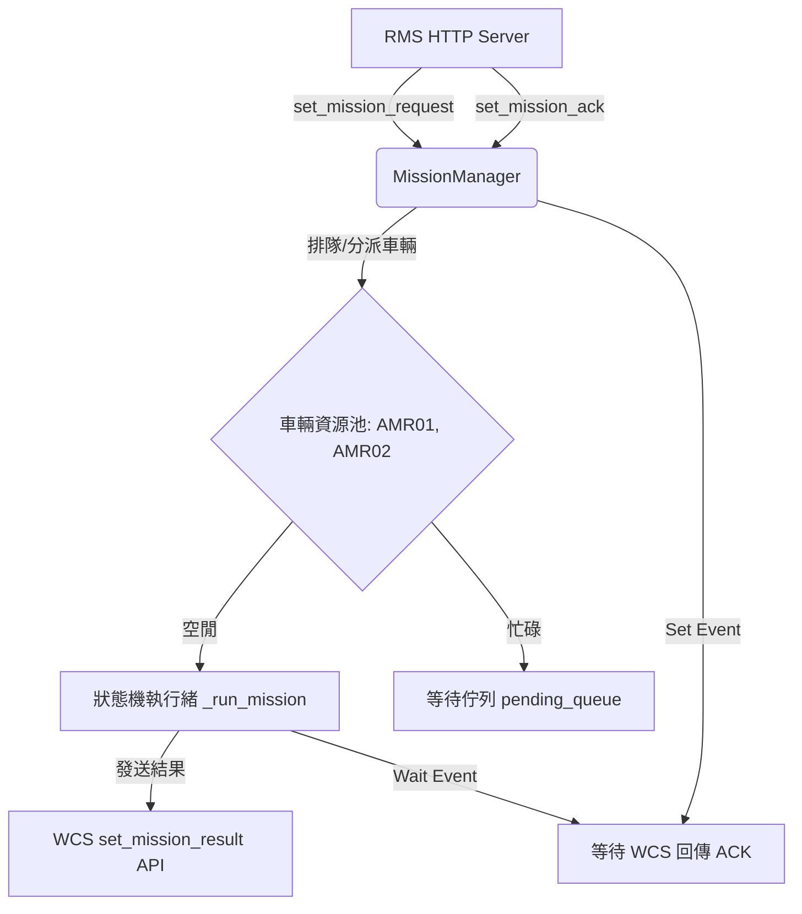
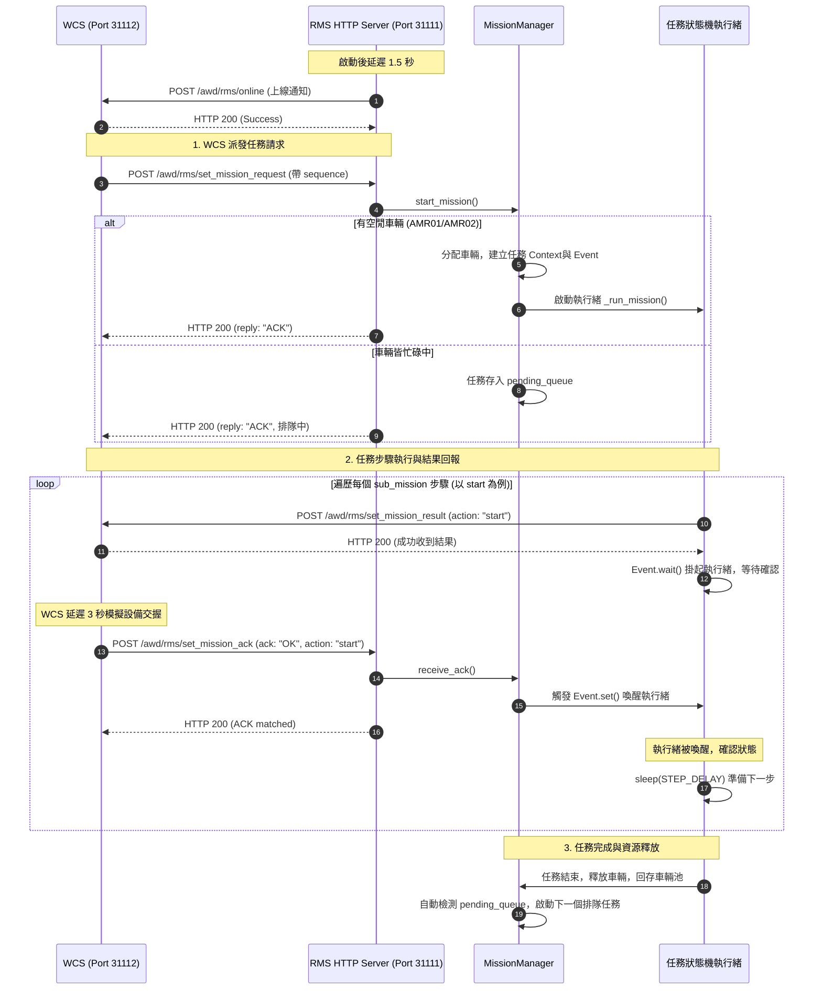

# RMS 模擬器程式功能與資訊流解析

本文件解析 `[rms_simulator.py](file:///c:/Sean_Documents/RMS+WCS_sim+Handshaking/rms_simulator.py)` 的核心功能設計、程式結構以及內部資訊流。

---

## 1. 程式概述

`[rms_simulator.py](file:///c:/Sean_Documents/RMS+WCS_sim+Handshaking/rms_simulator.py)` 是一個基於 Python 標準庫實作的 HTTP 伺服器，模擬 **RMS (Robot Management System)** 的行為。其主要職責為：
1. 接收來自 WCS 的搬運任務請求並進行排隊管理。
2. 指派虛擬 AMR (車輛資源 `AMR01`、`AMR02`) 執行任務。
3. 驅動搬運子任務狀態機，並依序向 WCS 回報各步驟的執行結果。
4. 接收 WCS 的 ACK 確認訊號，以控制步驟推進。
5. 於啟動時自動向 WCS 報到（發送上線狀態）。

---

## 2. 核心元件解析

模擬器內部主要由以下三大模組所構成：

### A. HTTP 請求處理器：`[RMSRequestHandler](file:///c:/Sean_Documents/RMS+WCS_sim+Handshaking/rms_simulator.py#L235)`
繼承自 `http.server.BaseHTTPRequestHandler`，並透過 `ThreadingHTTPServer` 支援高併發非同步請求處理。
* **`do_POST`**：解析傳入的 JSON 封包，並根據端點進行分流：
  * `/awd/rms/set_mission_request`：轉交給 `[MissionManager.start_mission](file:///c:/Sean_Documents/RMS+WCS_sim+Handshaking/rms_simulator.py#L84)` 處理。
  * `/awd/rms/set_mission_ack`：轉交給 `[MissionManager.receive_ack](file:///c:/Sean_Documents/RMS+WCS_sim+Handshaking/rms_simulator.py#L210)` 處理。

### B. 核心任務管理器：`[MissionManager](file:///c:/Sean_Documents/RMS+WCS_sim+Handshaking/rms_simulator.py#L73)`
控制任務排隊、車輛分配與任務狀態。
* **成員變數**：
  * `available_vehicles`：可用車輛資源池，預設為 `["AMR01", "AMR02"]`。
  * `pending_queue`：任務等待佇列。
  * `active_missions`：當前執行中任務的 Context（包含指派車輛、等待事件 `threading.Event`、期望的 Action 等）。
* **同步鎖保護 (`self.lock`)**：確保在多執行緒環境下（多個 HTTP 請求與多個任務執行緒並行）對車輛資源池與佇列的修改是執行緒安全的。

### C. 狀態機執行緒：`[MissionManager._run_mission](file:///c:/Sean_Documents/RMS+WCS_sim+Handshaking/rms_simulator.py#L121)`
為每個被分配到車輛的任務啟動一個獨立背景執行緒。它會遍歷任務中的所有 sub_missions 步驟：
1. 向 WCS 發送 `/awd/rms/set_mission_result`。
2. 呼叫 `[threading.Event.wait(timeout)](file:///c:/Sean_Documents/RMS+WCS_sim+Handshaking/rms_simulator.py#L175)` 讓執行緒掛起，阻塞等待來自 WCS 的 ACK。
3. 收到匹配的 ACK 事件後，執行緒被喚醒，若非最後一步則延遲 `STEP_DELAY`（預設 10 秒）後執行下一步驟。
4. 任務完成後釋放車輛，並自動觸發佇列中的下一個排隊任務。

---

## 3. 內部資訊流解析 (序列圖)

以下展示 WCS 與 RMS 模擬器在任務發送、執行與確認時的完整資訊流：

---

## 4. 關鍵機制總結

* **同步響應與非同步狀態推進**：WCS 呼叫任務請求和結果回報時，RMS 皆會**立即回覆 HTTP 200** 釋放連線，真正的搬運狀態推進則是透過背景執行緒（`_run_mission`）以非同步形式發送 API 進行。
* **事件驅動的掛起機制**：使用 `threading.Event` 實現非忙碌等待 (Non-busy waiting)，當狀態機等待 WCS 的 ACK 回應時，執行緒處於掛起狀態，不佔用 CPU 資源。
* **車輛資源的併發安全**：藉由 `threading.Lock` 限制對可用車輛清單及等待佇列的併發操作，避免因多任務同時完成或同時指派造成的競態條件 (Race Conditions)。
