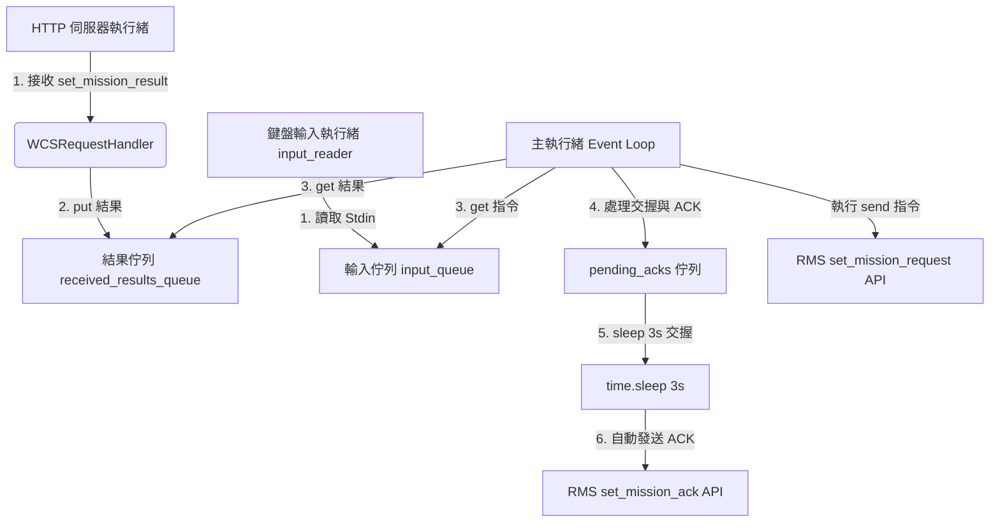
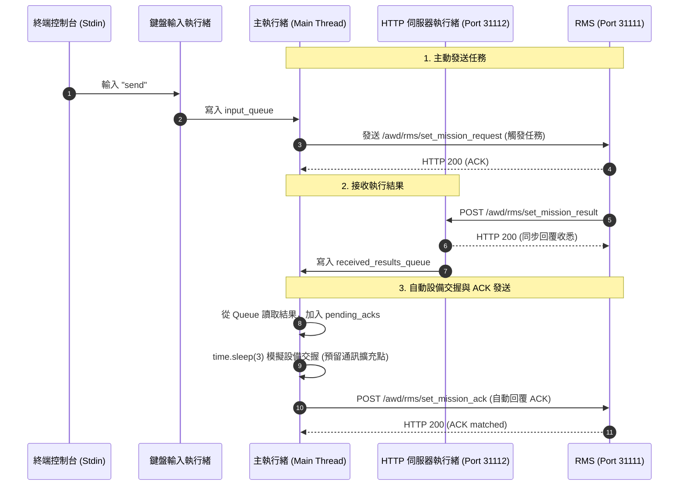

# WCS 模擬器程式功能與資訊流解析

本文件解析 `[wcs_simulator.py](file:///c:/Sean_Documents/RMS+WCS_sim+Handshaking/wcs_simulator.py)` 的核心功能設計、程式結構以及內部資訊流。

---

## 1. 程式概述

`[wcs_simulator.py](file:///c:/Sean_Documents/RMS+WCS_sim+Handshaking/wcs_simulator.py)` 扮演 **WCS (Warehouse Control System)** 的模擬端。相較於純伺服器端的 RMS，WCS 是一個**兼具 HTTP 伺服器與 CLI 操控端**的複合式應用：
1. **主動發送任務**：透過互動式命令列 (CLI) 提供使用者發送測試任務 (`send`) 到 RMS。
2. **接收任務狀態**：啟動 HTTP 伺服器，接收 RMS 執行的各步驟結果 (`set_mission_result`)。
3. **自動設備交握 (Handshaking)**：當收到任務結果後，自動進行 3 秒延遲以模擬與 PLC 的交握動作，隨後回覆 ACK 訊號通知 RMS 車輛可繼續前進。

---

## 2. 核心元件解析

WCS 模擬器採用多執行緒架構，以確保「讀取使用者指令」、「接收 RMS 結果」與「自動設備交握」三者互不干擾。

### A. HTTP 請求處理器：`[WCSRequestHandler](file:///c:/Sean_Documents/RMS+WCS_sim+Handshaking/wcs_simulator.py#L60)`
* 處理外部 HTTP POST 請求（例如 `/awd/rms/set_mission_result` 和 `/awd/rms/online`）。
* 當收到步驟執行結果時，會**立即同步回覆 HTTP 200** 告知已收悉，避免阻塞 RMS 的網路請求。
* 隨後將接收到的結果資料結構 put 放入全域的 `received_results_queue`，供主執行緒後續處理。

### B. 鍵盤輸入執行緒：`[input_reader](file:///c:/Sean_Documents/RMS+WCS_sim+Handshaking/wcs_simulator.py#L210)`
* 為了解決 `sys.stdin.readline` 讀取鍵盤輸入時產生的阻塞問題，WCS 將輸入功能移到獨立的 `daemon` 背景執行緒執行。
* 讀取到的終端機字串會以 Strip 整理後，put 寫入 `input_queue`。這能確保 Main Thread 保持非阻塞的輪詢狀態。

### C. 主執行緒事件迴圈 (Main Thread Event Loop)
在程式進入點的 `while True:` 迴圈中，主執行緒不斷執行以下三個階段：
1. **收集新結果**：檢查 `received_results_queue`，將所有新到的步驟結果轉存至 `pending_acks` 清單中。
2. **處理設備交握與 ACK 發送**：若 `pending_acks` 有待確認的項目：
   * 取出首筆項目。
   * 印出 `[設備交握]` 狀態。
   * 呼叫 `time.sleep(3)` 以模擬實體設備（如 PLC、光電感測器、閘門）的訊號交握延遲。
   * **此處預留了 Handshaking 程式寫入位置**，未來可直接替換為 Modbus 或 Socket 訊號通訊。
   * 呼叫 `[send_ack_to_rms](file:///c:/Sean_Documents/RMS+WCS_sim+Handshaking/wcs_simulator.py#L147)` 自動將 ACK 送回 RMS。
3. **處理使用者 CLI 指令**：若無待處理的 ACK，主執行緒會檢查 `input_queue` 以讀取使用者指令（如發送 `send` 任務或 `exit` 退出）。

---

## 3. 內部資訊流解析 (序列圖)

以下展示 WCS 內部多執行緒的合作與外部 API 互動過程：

---

## 4. 關鍵機制總結

* **資料通道 (Queues) 隔離**：藉由 `input_queue` 與 `received_results_queue` 將網路 IO（HTTP thread）及使用者鍵盤輸入（Stdin thread）與核心邏輯處理（Main thread）完全隔離，避免執行緒之間的資料競態或資源卡死。
* **輪詢非阻塞設計**：主執行緒透過 `input_queue.get(timeout=0.5)` 設定超時，得以在「等待鍵盤指令」與「處理網路狀態更新」之間流暢輪詢，隨時可被新事件中斷。
* **同步狀態解耦**：WCS 在接收 `set_mission_result` 時，採取「網路同步回覆成功 -> 內部非同步交握 + ACK」的設計，使 WCS 與 RMS 之間的連線不會因為本地 3 秒的設備交握延遲而佔用 HTTP Socket。
