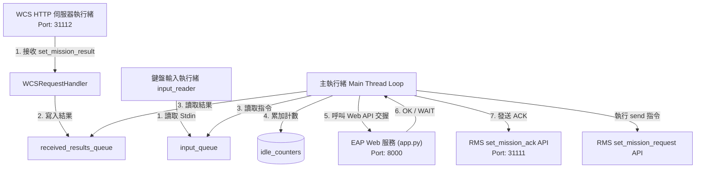
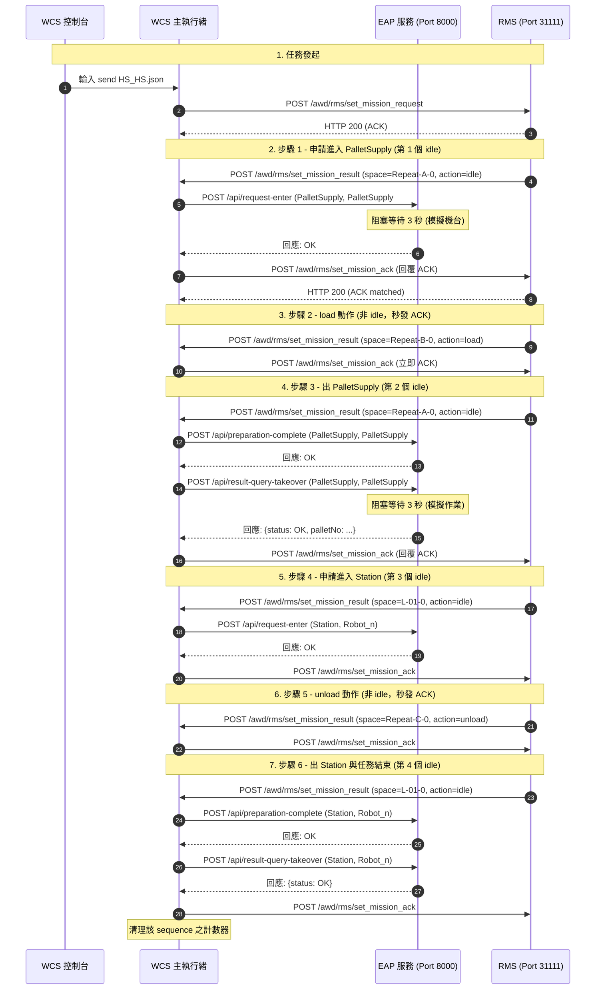

# WCS 模擬器程式功能與資訊流解析 (v1.1)

本文件解析最新版本 `[wcs_simulator.py](file:///c:/Sean_Documents/RMS+WCS_sim+Handshaking/wcs_simulator.py)` (v1.1) 的核心功能設計、程式結構、多執行緒事件迴圈以及實體設備 Web API 交握資訊流。

---

## 1. 程式概述

`[wcs_simulator.py](file:///c:/Sean_Documents/RMS+WCS_sim+Handshaking/wcs_simulator.py)` 扮演 **WCS (Warehouse Control System)** 模擬端，是一個**結合了 HTTP 伺服器、互動式 CLI 控制台與 EAP 設備交握 API** 的複合式核心應用：
1. **主動發送任務**：透過互動式命令列 (CLI) 提供使用者發送搬運任務（如發送 `send HS_HS.json`）到 RMS。
2. **接收任務狀態**：啟動 HTTP 伺服器，非同步接收來自 RMS 執行的各步驟結果 (`set_mission_result`)。
3. **實體設備 Web API 交握**：在收到任務結果為 `idle` 時，WCS 會藉由計數器與硬寫死的條件分支，向外部 EAP 服務 (Port 8000) 發送對應的 Web API 請求進行同步阻塞交握，待機台回覆 `OK` 後才向 RMS 回覆 ACK 推進任務。
4. **可配置連線參數**：啟動時支援指定 RMS 與 EAP 的 IP 與 Port，增強跨主機部署的彈性。

---

## 2. 系統架構與核心元件

WCS 模擬器採用多執行緒非阻塞架構，並搭配資料通道（Queues）進行解耦，使網路 IO 與交握運算不阻塞控制台運作。

### A. HTTP 接收端點 (`[WCSRequestHandler](file:///c:/Sean_Documents/RMS+WCS_sim+Handshaking/wcs_simulator.py#L60)`)
* 監聽 WCS 伺服器 Port (預設 `31112`)。
* 接收來自 RMS 執行的步驟結果，立即回覆 HTTP 200 `success` 響應，並將結果資料結構放入全域的 `received_results_queue`。此非同步處理機制可避免 WCS 連線超時阻塞 RMS 的執行緒。

### B. CLI 讀取器 (`[input_reader](file:///c:/Sean_Documents/RMS+WCS_sim+Handshaking/wcs_simulator.py#L210)`)
* 作為背景 Daemon 執行緒讀取終端機 `sys.stdin`，輸入的字串會寫入 `input_queue`。

### C. EAP Web API 整合層 (`[wcs_simulator.py](file:///c:/Sean_Documents/RMS+WCS_sim+Handshaking/wcs_simulator.py#L173-L257)`)
* 利用內建 `urllib` 發送 HTTP POST 請求到自訂 EAP 服務端點：
  * `call_request_enter` 呼叫 `/api/request-enter`：申請進入設備干涉區。
  * `call_preparation_complete` 呼叫 `/api/preparation-complete`：準備完成通知。
  * `call_result_query_takeover` 呼叫 `/api/result-query-takeover`：同步等待接手結果。

### D. 特定步驟編號分支交握邏輯 (`[wcs_simulator.py](file:///c:/Sean_Documents/RMS+WCS_sim+Handshaking/wcs_simulator.py#L342-L375)`)
* 全域 `idle_counters` 用以記錄特定序號（`sequence`）已發生的 `idle` 次數。
* 當 `action == "idle"` 時，呼叫 `get_idle_counter(seq)` 取得累計次數：
  * **`idle_count == 1`**：呼叫 `call_request_enter`（設備: `PalletSupply`, ID: `PalletSupply#1`, 目的: `1`）。
  * **`idle_count == 2`**：出設備完工交接，呼叫 `call_preparation_complete` 與 `call_result_query_takeover`（設備: `PalletSupply`, ID: `PalletSupply#1`, 目的: `1`）。
  * **`idle_count == 3`**：呼叫 `call_request_enter`（設備: `Station`, ID: `Robot_n`, 目的: `1`）。
  * **`idle_count == 4`**：出設備完工交接，呼叫 `call_preparation_complete` 與 `call_result_query_takeover`（設備: `Station`, ID: `Robot_n`, 目的: `1`）。
  * **`idle_count >= 5`**：預留未來擴充分支之介面。
* 交握 HTTP 請求採同步阻塞，確保設備回覆後才執行 `send_ack_to_rms`。當遇到 `end` 動作時，自動清除該 sequence 的計數，釋放記憶體。

---

## 3. 內部資訊流解析 (序列圖)

以下序列圖以包含 4 次 `idle` 交握的任務（如 `HS_HS.json`）為例，展示 WCS 主執行緒、EAP 服務及 RMS 模擬器之間的整合互動過程：

---

## 4. 系統設計特點

* **特定步驟編號分支彈性**：WCS 將交握步驟與 AMR 狀態拆分，在 `action == "idle"` 時根據累計次數（1, 2, 3, 4）來呼叫不同的 EAP 參數。這讓系統能以極低的修改複雜度，支援偶數個（如 2, 4, 6, 8, 10 等）交握工位的任意排列組合。
* **HTTP 同步阻塞控制流**：WCS 利用 HTTP 請求的同步等待特性，將 EAP 機台狀態阻塞傳導至 WCS 主迴圈，迫使 WCS 暫停向 RMS 回傳 ACK。這在沒有複雜多執行緒鎖的狀態下，完美實現了 AMR 的狀態推進卡制。
* **命令行與環境解耦**：WCS 與 EAP 接頭均支援啟動參數覆寫（`--eap-host`, `--eap-port`），確保本機調試與實體跨電腦部署的指令一致性。
